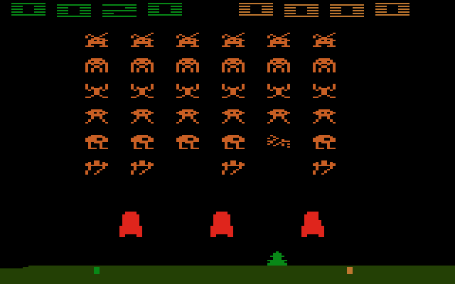

# Project Introduction


**UPDATE IN PROGRESS:** This project guidebook will be replaced with a [revised version](https://docs.idew.org/project-video-game/) during summer 2019.


[People have been creating and playing games on computers, ever since the earliest computers were built in the 1940s](https://en.wikipedia.org/wiki/History_of_video_games). However, early computers did not have video monitors, so the earliest computer games weren't technically video games.

In 1958, one of the first video games — called "Tennis for Two" — was created using an oscilloscope \(a device normally used to view electrical signals\). Special paddle inputs were built to play the game.

**VIDEO:** [Tennis for Two - one of the original video games](https://www.youtube.com/watch?v=6PG2mdU_i8k)

Up until the 1970s, computers were expensive, large-scale machines used primarily by governments, universities, and corporations — so very few people actually played any early computer games.

Then in the 1970s, the development of microprocessor chips allowed computers to become much smaller, less expensive, and easier to manufacture. As a result, coin-operated video arcade games \(such as [Pong](https://en.wikipedia.org/wiki/Pong), etc.\) were introduced into amusement arcades, restaurants, and other public places — quickly becoming a popular form of entertainment. Soon after, the first personal computers \(such as the [Apple II](https://en.wikipedia.org/wiki/Apple_II), etc.\) and gaming consoles \(such as the [Atari 2600](https://en.wikipedia.org/wiki/Atari_2600), etc.\) became available to consumers, finally bringing video games into people's homes — and starting an obsession that continues today.

**Space Invaders** was introduced as a video arcade game in 1978, quickly becoming extremely popular. In 1980, the first licensed home version \(shown above\) was made for the Atari 2600 gaming console, which quadrupled sales of the Atari — and made Space Invaders the first ["killer app"](https://en.wikipedia.org/wiki/Killer_application) for gaming consoles. Official versions and unofficial clones of the game were created for nearly every computer and gaming console in the early 1980s.

According to the [2017 video game industry report by the Entertainment Software Association](http://www.theesa.com/wp-content/uploads/2017/06/!EF2017_Design_FinalDigital.pdf), 65% of U.S. households have at least one person that plays video games regularly, and almost half of households have a dedicated gaming console. U.S. video game players are more diverse in terms of age and gender than you might think. The average video game player is 35 years old, and over 40% of players are female.

In 2016, U.S. consumers spent over $24 billion just on video game content. In fact, over 65,000 U.S. employees work for video game companies, earning an average of $97,000 per year.

Clearly, many people love to play video games. What is it about these games that people love so much? What makes certain games appealing to us but not others?

_**Could you create a video game that people would want to play?**_

[Notes for Teachers](notes-for-teachers.md)

## Copyright and License

Copyright © 2016-2019 Michael Frontz and Jim Lyst, Indiana University School of Informatics and Computing at IUPUI

This material is part of the [Computing by Design](https://docs.idew.org/the-cxd-framework/) high school computer science curriculum developed for the [Informatics Diversity-Enhanced Workforce \(iDEW\)](http://soic.iupui.edu/idew/) program, an award-winning community partnership in central Indiana that is broadening student participation in computing and helping students develop the skills essential for success in the 21st century workplace. The iDEW program is managed by the [Indiana University School of Informatics and Computing at IUPUI](https://soic.iupui.edu/).

This work is licensed under a [Creative Commons Attribution-NonCommercial-ShareAlike 4.0 International License](http://creativecommons.org/licenses/by-nc-sa/4.0/). You are free to use, share, or adapt this material for noncommercial purposes as long as you provide proper attribution and distribute any copies or adaptations under this same license.

