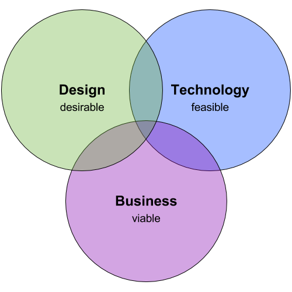

# Notes for Teachers

_Computing by Design_ targets the intersection of design, technology, and business — where innovative product and service experiences are created.

This project focuses on the game design process. Like all _Computing by Design_ projects, this course will help students learn how to build a solution using a particular computing technology. However, just as importantly, this project will help students learn how to design their solution to meet the needs and expectations of the intended users. After all, how do you market and sell a solution that no one actually wants to use?

Perhaps even more importantly, this project will help students practice and strengthen their skills in the 4Cs: _Creative Thinking, Critical Thinking, Communication, and Collaboration_. Expertise in the 4Cs will serve students for a lifetime, regardless of their specific college and career path.

The assumption is that students participating in this video game project have completed at least one previous _Computing by Design_ project and have some \(albeit limited\) experience with HTML, CSS, and JavaScript. The project materials will provide references and examples to assist learners with using the Phaser JS game engine to code their games.

This video game project is based on a revision of the Fall 2016 pilot curriculum. Project revisions for Fall 2017 include \(but are not limited to\):

* Revised and expanded practice assignments up-front to provide **all** students with increased knowledge and experience in Phaser JS coding, as well as with asset creation \(sprites, sounds\)
* Phaser coding Reference section within GitBook \(instructions, examples, troubleshooting, etc.\) to supplement other online resources available elsewhere
* Project will require team to create marketing website for game \(instead of, or in addition to, promotional cards\), as well as a trailer video demonstrating the gameplay

This team-based project is intended to be completed as a semester-long course \(but could be shortened or extended as desired\). As a semester-long course, the suggested schedule is as follows:

1. **Research Problem Space** = 4-5 weeks
2. **Define Problem to Solve** = 1-2 weeks
3. **Design Solution & Deliver Proposal** = 2-3 weeks
4. **Build & Develop Solution** = 4-6 weeks
5. **Evaluate & Improve Solution** = 1 week
6. **Reflect & Present Project Results** = 1 week

The "Research Problem Space" phase consists of individual student assignments, whereas the project team assignments begin with the "Define Problem to Solve" phase. It may be best to wait to form project teams until the **end** of the first phase, so that students can be partnered based on their personal gaming motivations and their areas of strength and interest \(coding, art, etc.\). It is important that teams are diverse yet complementary in their interests, thinking, and skills.

This project utilizes the Phaser JS game engine, which offers many advantages for learners new to creating video games. However, this project could be modified to use other available game engines. The game design process will be similar, regardless of the specific game engine used for development.

## ADDITIONAL RESOURCES

**History of Video Games**

[Crash Course: Games](https://www.youtube.com/playlist?list=PL8dPuuaLjXtPTrc_yg73RghJEOdobAplG) \(YouTube series\)

**Game Design Process**

Fullerton, T. \(2014\). _Game design workshop: A playcentric approach to creating innovative games_ \(3rd ed.\). Boca Raton, FL: CRC Press. [LINK](https://www.google.com/?gws_rd=ssl#safe=active&q=fullerton+game+design+workshop)

Schell, J. \(2015\). _The art of game design: A book of lenses_ \(2nd ed.\). Boca Raton, FL: CRC Press. [LINK](https://www.google.com/?gws_rd=ssl#safe=active&q=schell+art+of+game+design)

**Coding Games with Phaser.js**

[Phaser.io](http://phaser.io/) \(download Phaser.js, code examples, API documentation, etc.\)

Faas, T. \(2016\). _An introduction to HTML5 game development with Phaser.js_. Boca Raton, FL: CRC Press. [LINK](https://www.crcpress.com/An-Introduction-to-HTML5-Game-Development-with-Phaserjs/Faas/p/book/9781138921849)

