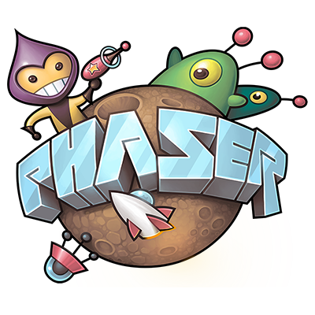

# Project Challenge

## How do we create video games that people want to play?

During this project, the entire class represents a video game company that will be divided into teams. Each team will design and develop its own video game concept. The teams will help improve each other’s games through feedback and playtesting.

At the conclusion of the project, all teams will present their video games at a public game convention.

## Design Constraints

* Browser-based game created using [Phaser JS game engine](http://phaser.io/)
* 2D game world
* Single player game \(or multi-player game using single computer\)
* Single level game \(or single level of multi-level game\)

## Design Criteria

* **Innovative**: Game is unique \(could be unique remix of existing game concepts\).
* **Engaging**: Game is fun and motivating to play \(based on targeted gaming motivations\).
* **Functional**: Game is functional and has no major problems \(such as loopholes in rules that provide unintended advantage, dead ends that prevent player from progressing, etc.\).
* **Usable**: Game provides clear feedback to player and is easy for new player to understand \(such as learning game's controls, rules, objectives, etc.\).
* **Balanced**: Game mechanics are fine-tuned to produce desired gameplay experience \(such as balancing success vs. failure, risk vs. reward, skill vs. chance, etc.\).

## Design Team Roles

Each team member will be a **Game Designer**, contributing to the ideas, decisions, and work related to the design of their team's game.

In addition, each team member will have at least one other specialized role:

* **Programming Lead**: leads programming of game
* **Art Lead**: leads creation of art and sound for game
* **Research Lead**: leads playtesting and marketing of game
* **Project Manager**: leads team to ensure work is high-quality and completed on time

The recommended team size is 2-4 people. Your teacher will determine how many people each team must have:

* **Teams of 2 people** need to have separate people acting as Programming Lead and Art Lead.  Each person will also take on one of the other remaining roles. It is recommended to have the Programming Lead also act as the Project Manager and to have the Art Lead also act as the Research Lead.
* **Teams of 3 people** need to have separate people acting as Programming Lead, Art Lead, and Research Lead.  One person will also act as the Project Manager. It is recommended to have the Research Lead also act as the Project Manager.
* **Teams of 4 people** will have separate people acting in each of the four roles.

Each team member is responsible for contributing meaningfully at all times to the team project. Each team member must be willing and able to help work on **any task at any time** when needed. One of the responsibilities of the Project Manager is to ensure the team is working and collaborating effectively.

**IMPORTANT:** Each lead person is responsible for planning and delegating the tasks for their speciality area. However, this does not mean that only one person completes that type of work. At certain times, multiple team members will be working together on the same task, while at other times, they may be working in parallel on different tasks.

## Final Team Deliverables

* **Video Game** that is published online and ready to play
* **Marketing Website** for game, which includes a gameplay demo video and a link to play game
* **Poster** for final presentation that highlights key features of game and key steps in creating game
* **Presentation** at public game convention to demonstrate game and explain how it was designed, built, and tested

