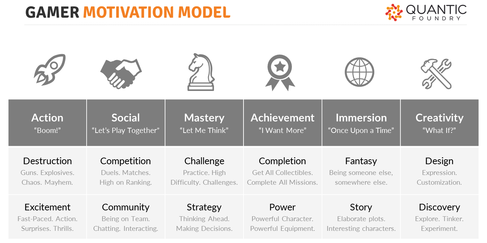

# 1-1 Determine Gamer Motivation Profile

## What types of video games do you like to play?

Just as people like different types of books or movies, people like different types of video games. If you're going to design a video game, you'll need to know more about what motivates people to play certain games.

You'll start by taking a survey to determine your own Gamer Motivation Profile. Later in the project, each team will decide what gamer motivations their game will target.

[Quantic Foundry](http://quanticfoundry.com/) is a game analytics consulting company that has gathered data from over 300,000 video game players to construct a scientific model that describes different types of gamer motivations.

This model identified 12 motivations that clustered into 6 pair groups: Action, Social, Mastery, Achievement, Immersion, and Creativity. For example, _Challenge_ and _Strategy_ are motivations that belong to the _Mastery_ group.

**VIDEO:** This gamer motivation model was constructed using a statistical method called factor analysis. If you're interested, Quantic Foundry has a [video explaining how this model was built](https://www.youtube.com/embed/YZwiQd-0xqQ?start=0&end=380) using survey data collected from thousands of video game players.

## YOUR TASK

1. [Take the online survey](https://apps.quanticfoundry.com/surveys/start/gamerprofile/) to determine your Gamer Motivation Profile. The survey takes about 5-7 minutes.
2. Record your results in [this assignment document](https://drive.google.com/open?id=1QtWFyRvM4sgI5W1iHRpx-60IMaf7P4drH122iJjbMoc).
3. Discuss and compare your results with others in the class.

## Assignment Templates

Some of the assignments in this project guidebook include links to Google Drive templates \(document, spreadsheet, slide presentation, drawing, etc.\). All the templates are shared as "**View Only**." Students must create a **copy** of the template in order to modify it. \(Students should **not** request edit access, as the file is a master template for all students.\)


**MAKE A COPY:** To use a Google template, be sure you're logged in to your Google Account. From the **File** menu of the template, select **Make a copy**. Save the copy to your shared team folder in Google Drive. The copied file can now be modified.


