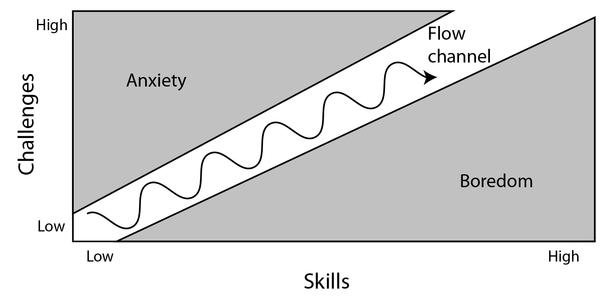

# 1-3 Analyze Internal Motivations in Games

## How can games encourage internal motivation in players?

In the previous assignment, you explored the use of external motivations, such as rewards and punishments, in games. In this assignment, you'll explore internal motivations in games.

People naturally want to avoid feeling bad, such as having a fear of failure, avoiding embarassment, etc. This **negative internal motivation** is rooted in avoiding fear, anxiety, and unhappiness. \(Avoiding feeling bad is not necessarily the same as feeling good. It may mean feeling neutral — and probably after already experiencing some fear, anxiety, or unhappiness.\)

Research has shown that **positive internal motivation** is much more effective in the long-term for encouraging sustainable behavior. People naturally want to do things that make them feel good. Obviously, there is a variety of ways to feel good: having fun, feeling relaxed, feeling excited, feeling a sense of satisfaction, being mentally engaged, etc.

As a type of play, games are supposed to be fun. As we've seen, what seems fun to one person may not be fun to another. If you haven't already figured it out, the [12 gamer motivations](1-1-determine-gamer-motivation-profile.md) \(such as: competition, community, challenge, power, story, discovery, etc.\) are examples of positive internal motivations — certain people find these types of experiences to be fun.

## FLOW

When doing certain tasks, people can sometimes experience a mental state of deep engagement called **flow**. This is sometimes referred to this as "being in the zone". It could be considered the ultimate form of positive internal motivation.

People can experience flow in various types of tasks, including: art, music, sports, games, work, etc. However, experiencing flow requires certain conditions.

**VIDEO:** [This video talks about flow in video games](https://www.youtube.com/embed/x4ao7HjcZBM?start=0&end=222) and how game designers can encourage flow.

When you are experiencing flow:

* You are completely focused on the task \(e.g., you might even forget to eat, etc.\)
* You have a feeling of control \(e.g., you know what you need to do, you feel confident, etc.\).
* You aren't thinking about yourself \(e.g., your worries melt away, etc.\).
* You lose awareness of time \(i.e., usually time seems to fly by — hours can seem like minutes\).
* You enjoy doing the task for its own sake \(i.e., positive internal motivation\).

Conditions needed to experience flow include:

* Avoiding distractions
* Having clear goals
* Receiving clear immediate feedback
* Having proper balance of challenges vs. skills

Challenge plays a critical role in whether or not doing a task can lead to flow. This diagram shows how flow is affected by the balance of challenges vs. skills:

* If a challenge is **too high** compared to your current skills, it leads to anxiety — and you'll probably stop doing the task.
* If a challenge is **too low** compared to your current skills, it leads to boredom — and you'll probably stop doing the task.
* If a challenge is **well-matched** to your current skills, it leads to focus and a sense of control — and you'll probably stay engaged in the task. You're in the flow state.

Over time, your skills tend to increase, so the challenges also need to increase in order to keep you in a flow state.

As a game designer, you can make sure your game has the right conditions to encourage flow:

* **Eliminate distractions in the game that aren't related to the intended gameplay.** For example, excessive or unnecessary visual effects or sound effects might be distracting. Glitches or unresponsiveness in the game can distract players.
* **Make sure your game provides clear goals and feedback to the player.** Make it easy for the player to understand the game's objectives and controls. \(This is why many games have tutorial modes in the beginning.\) Use sound effects, animations, and the user interface to provide feedback to the player \(but avoid becoming distracting\).
* **Make sure your game appropriately balances challenges vs. skills.** Avoid or limit gameplay that's too easy or too hard. Increase the challenges in the game as the player's skills progress. This may involve making the challenges more difficult or introducing new challenges. Games that require repeated practice for players to improve can lead to flow.

On the other hand, some games are specifically designed to to be very hard to promote a constant state of anxiety \(e.g., _Flappy Bird_\), while other games are designed to be easy in order to provide a relaxing experience. This is obviously fine — not every game has to necessarily provide a flow experience.

Nonetheless, incorporating **flow conditions** — such as clear objectives, clear feedback, appropriate challenge, etc. — will typically improve your game's design, regardless of whether your game actually leads to a flow state.

## YOUR TASK

1. Follow the instructions and links in [this assignment](https://drive.google.com/open?id=1OO2xA71tu7Zu-F039-CgDurWYhrpkrQjr5jNTumrZJ4) to playtest two games to compare their use of flow conditions.
2. Discuss your findings as a class.

