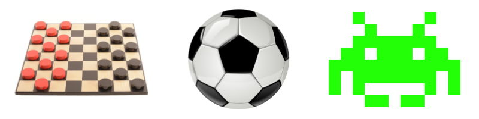
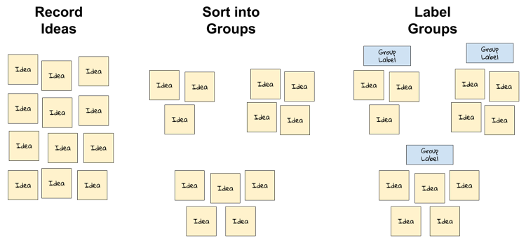

# 1-4 Analyze Game Design Elements

## What do games have in common with each other?

Games have certain design elements that help define them as being games — whether it is a board game, a card game, a sport, a video game, etc. If you're going to create a game, you'll need to make design decisions about all the key elements of your game.

For example, we all recognize checkers, soccer, and Space Invaders as being examples of games. What do these have in common that defines them as being games?

We would probably agree that one element that games have is **players** — people that agree to participate in the game. Checkers has two players. Soccer features two teams of players. Space Invaders is a single-player game. Every game has one or more players as part of its design.

Game designers have come up with different ways to define the elements of games. In this assignment, you will define your own set of game design elements by constructing an _affinity diagram_.

An [affinity diagram](https://uxdict.io/design-thinking-methods-affinity-diagrams-357bd8671ad4) is a way to take a large set of information \(such as ideas, etc.\) and sort it into a smaller set of groups that reveal patterns and relationships.

Constructing an affinity diagram involves three basic steps: 1. **Record each idea** separately. It helps to use index cards or sticky notes, if possible. Otherwise, make a list. 2. **Sort related ideas into groups**. You can have as many groups — or as few groups — as you need, based on the patterns in the ideas. 3. **Label each group** to identify the pattern or relationship they represent.

After you construct the affinity diagram, you'll compare your results with a specific list of game design elements that we'll be using for this project.

## YOUR TASK

1. Work with a partner or small group to construct an affinity diagram of the elements that define games. Record your ideas, sort them into groups, and label the groups.
2. Discuss your findings as a class. How similar are they?
3. Compare your findings to this [reference list of game design elements](https://drive.google.com/open?id=0B8MTiM_lFG9TcjVsa21BR0FhbXc). How similar are they?
4. Use the reference list to analyze the design elements of an existing game by completing [this template](https://drive.google.com/open?id=1UP6mGoubPeGvyJ1Yn6NVKLRNdg63RakZI_W3by-EK6w). As an example, here is an analysis of the [game design elements of Space Invaders](https://drive.google.com/open?id=0B8MTiM_lFG9TOC1xVEdnSE1BbmM).

