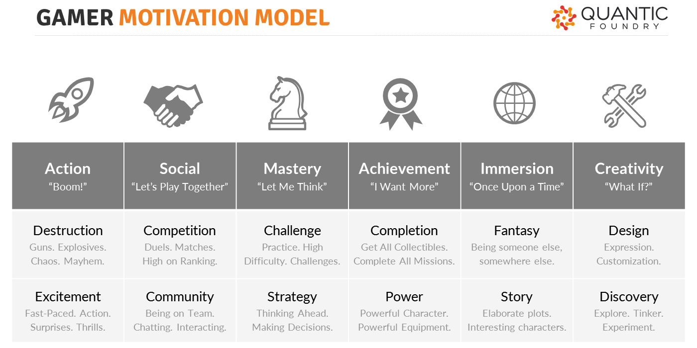

# 2-2 Create Persona for Target Players

Before your team starts generating specific ideas for its game, it will help to narrow your design focus by defining: 1. what kind of gameplay experience you want to design 2. who are the target players you're designing for

## Determine Gaming Motivations

The kind of gameplay experience that you'll design is first defined by the **gaming motivations** that your team wants to target \(such as: Strategy, Story, etc.\).

Most games target more than one gaming motivation, often from more than one motivation group \(e.g., Mastery + Immersion\). Incorporating multiple gaming motivations \(from multiple groups\) can make the game more engaging — and allows it to appeal to more players.

Your team will select 2-3 motivations \(representing at least two different motivation groups\) to target for the game it will design.

* _For example, your team might decide to design a game with Challenge, Strategy, and Completion as its motivations \(which represent the motivation groups of Mastery and Achievement\)._

Every team member should have one of his/her top gaming motivations represented in your team's selected set of motivations. This will help ensure that everyone on the team will be interested in designing and creating the game.

## Determine Player Experience Goals

Next your team will use its set of targeted gaming motivations to develop one or more **player experience goals**.

A player experience goal is a description of the kind of gameplay experience you want players to have.

Screenshot from The Walking Dead game: you play as Lee, who rescues a girl named Clementine during a zombie apocalypse

For example, Telltale Games is a company that created a [series of video games based on _The Walking Dead_ comics](https://en.wikipedia.org/wiki/The_Walking_Dead_%28video_game_series%29). These point-and-click adventure games have been critically-acclaimed and very popular. The gaming motivations for these games include: _Fantasy_, _Story_, _Strategy_, and _Excitement_.

Some of the player experience goals for these games could be described as:

* "Players will feel scared and uncertain as they try to survive in a world filled with zombies."
* "Players will have to quickly make difficult decisions affecting characters they care about."

Notice several things about these player experience goals:

* **The player experience goals relate back to the targeted gaming motivations.**  For example, "scared and uncertain" relates to _Excitement_, "try to survive" relates to _Strategy_, "a world filled with zombies" relates to _Fantasy_, "quickly" relates to _Excitement_, "difficult decisions" relates to _Strategy_, "characters they care about" relates to _Story_.
* **The player experience goals focus on what the players will do and how they will feel.** They do not focus on specific game features such as graphics, number of levels, etc. \(The most specific reference in these examples is to "zombies" because these games are based on an existing comics series about zombies.\) Instead, the player experience goals are later used to help design the specific game features. For example, these games use dark colors and dim lighting to help make the game feel scary. The games feature interactive conversations between the player and the other characters, so the player develops empathy for them. The games use a timer to force the player to make nearly every response or decision quickly. And so on...
* **The player experience goals help narrow the focus for thinking of game design ideas** — but they are also broad enough to allow a range of possible game designs.

Your team will develop at least one player experience goal based on your team's set of targeted gaming motivations.

## Create Target Player Persona

A **persona** is a model of a target user for a product or service, such as an app or a game. A persona summarizes the target user’s background, motivations, goals, and needs. The persona helps you design a solution to meet the target user’s expectations.

A persona is presented as a one-page description of an individual person, even though the persona actually represents a group of users with similar characteristics.

A persona is normally based on data collected from multiple users through observations, interviews, surveys, etc.

The persona for your video game will be created slightly differently. You will start with the gaming motivations and player experience goal\(s\) that your team has already decided to target for your game's design.

Then you'll create a realistic description of a player that has those motivations and goals. The player's description will include relevant background information \(such as age, etc.\) as well as information about their general needs and expectations related to video games.

Ideally, you should base your persona on data gathered from actual people representing your target players. In this case, you can use the data gathered from your team interview \(and then add other information as necessary\).

Your team will use the target player persona to help inform your decision-making as you design, build, and test your game. For example, when your team is debating whether to add a certain feature to the game, you could ask yourselves whether the feature would make the game a better experience for the target player persona.

## YOUR TASK

1. Compare the top 5 gaming motivations of each member of your team. \(Refer back to your team interview notes.\)
2. Decide on **2-3 gaming motivations** \(representing at least 2 different motivation groups\) that your team will be used to design its game.
   * Each team member should have at least one of his/her top 5 gaming motivations represented in your team's selection.
   * The **gaming motivations** are: Destruction, Excitement, Competition, Community, Challenge, Strategy, Completion, Power, Fantasy, Story, Design, Discovery.
   * The **motivation groups** are: Action, Social, Mastery, Achievement, Immersion, Creativity.  Each group contains two of the motivations listed previously.
   * Keep in mind that motivations from the Social group may not work for a _single player game_ \(which is one of the design constraints in your [project challenge](../project-challenge.md)\).
3. Based on your team's set of 2-3 gaming motivations, develop at least one **player experience goal** for the game your team will design.
4. Use [this template](https://drive.google.com/open?id=1LIyQ9f4P3YN81I7tAiy-5X4kK4FuaNrgRLcZtzB5pUg) to create a **persona** representing a target player that your team will design its game for.
   * Start by listing the gaming motivations and player experience goal\(s\) that your team's game will target.
   * Develop a background and other relevant information for the target player.  Include a photo, first name, and player type \(e.g., casual gamer, hard-core gamer, etc.\).
   * Even though the persona is fictional, the information should be realistic and consistent. The persona should seem like a real person, not a joke or a stereotype.

