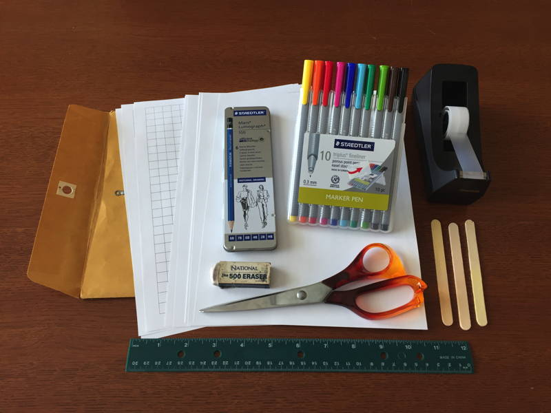
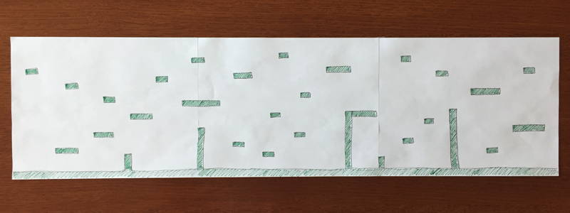
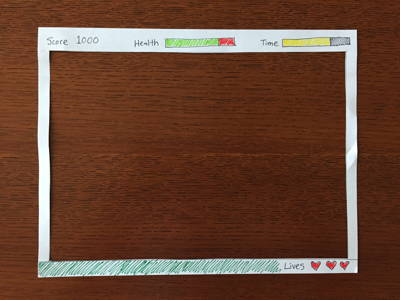
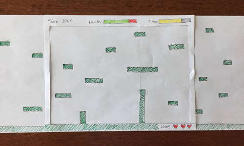
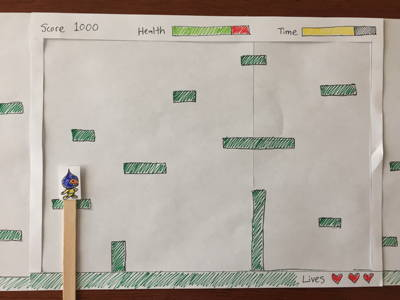

# 3-2 Create Paper Prototype of Game

Now your team will use its game design document to create a **paper prototype** of your game. In the next assignment, your paper prototype will be playtested to help evaluate your game's design.

Even though a paper prototype cannot simulate all the aspects of a video game, you will hopefully discover that creating and playtesting a paper prototype should help:

* clarify your team's conceptual model of the game
* verify which game design elements are working well
* identify which game design elements may need improvement

In the long run, the paper prototype should help you save time and effort because it allows you to improve your game design before you start coding the game and creating digital artwork.

**DEMO VIDEOS:**

* [Paper Prototype Example 1 — Remote Control](https://www.youtube.com/watch?v=y5U645KA5NM)
* [Paper Prototype Example 2 — Flying Toucan](https://www.youtube.com/watch?v=mZyKyiRCxwk&t=21)
* [Paper Prototype Example 3 — Monkey vs. Mosquito](https://www.youtube.com/watch?v=KQ38gS7SNok&t=20)

### Recommended Materials:

* Blank paper
* [Graph paper with large grid squares](https://drive.google.com/open?id=0B8MTiM_lFG9TMXJ4WFFaWl9iZTA) \(helpful if drawing tile-based game world\)
* Pencils and eraser
* Colored pencils or markers
* Ruler \(for drawing lines or drawing to scale\)
* Scissors
* Clear adhesive tape
* "Sticks" \(for attaching to characters and game objects\) — such as: small wooden sticks, strips of paperboard, etc.
* Large envelope or folder \(to store your paper prototype\)

## Creating Paper Prototype of Video Game

The paper prototype should include \(as separate paper parts\):

* game world
* user interface information displayed to player \(such as: score, status, etc.\)
* player's character
* non-player characters \(opponents, allies, etc.\)
* key game objects \(resources, obstacles, etc.\)

Sometimes physical objects — such as coins, etc. — can be used to represent game objects.

### GAME WORLD

If the game world extends beyond the game display, then tape together multiple sheets of paper \(horizontally and/or vertically\) to draw the game world.

Part of the game world for a side-scrolling platform game

You don't necessarily have to draw the entire level yet \(or include all its details\) — but create enough of the game world to be able to sufficiently test the gameplay.

### USER INTERFACE

Games typically have a user interface that displays certain information to the player \(such as: score, health, time, lives, etc.\). This information is often shown along the top and/or bottom edges of the game display.

If your game will only display information along one edge of the screen, you can use a strip of paper to draw your user interface.

If your game will display information along **multiple edges** \(such as top and bottom, etc.\), you can cut out the center of a sheet of paper to create a "window" — which will allow you to draw your user interface along whichever edges you need.

User interface window showing score, health, and remaining time along top edge and a lives counter along bottom edge.

The strip or window representing your user interface can then be placed on top of your game world during playtesting.

### SCROLLING

Games with extended worlds typically have the game display scroll to follow the player's movements. To simulate this, place your user interface on top of your game world, and then move the user interface as the player moves \(while keeping the game world fixed in place\) — or you can slowly pull the game world in the opposite direction that the player is moving \(while keeping the user interface fixed in place\).

### CHARACTERS AND OTHER OBJECTS

Characters and other key game objects should be drawn on paper and cut out as separate parts.

Characters or other objects that are supposed to move can be attached to sticks to make it easier to move and use them during playtesting.

Even if game objects won't move in the real game, it is helpful to create them as separate parts — rather than drawing them on the game world — because it allows you to easily:

* remove objects during playtesting \(to represent them being collected or used\)
* replace objects during playtesting \(to represent them changing or animating\)
* change the locations of objects in the game \(to see how it affects the gameplay\)
* change the quantity of objects in the game \(to see how it affects the gameplay\)

### ANIMATIONS

You can "animate" characters or other objects by creating multiple versions of them \(representing different actions or animation frames\).

If helpful, you can also animate user interface elements. For example, a health bar could be animated by cutting out a small window for the bar, placing a colored strip of paper behind the window, and then moving the paper strip left or right to represent the health decreasing or increasing.

### YOUR TASK

Your team should create a paper prototype of your game concept based on your game design document.

* Focus on prototyping the core gameplay — at this point, don't worry about prototyping a title screen, menu screen, etc.

