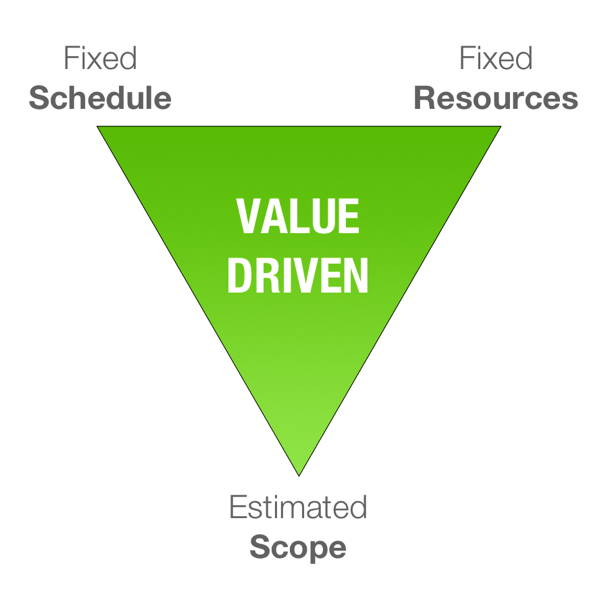
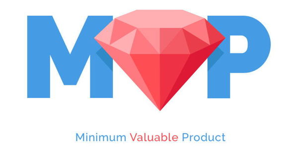
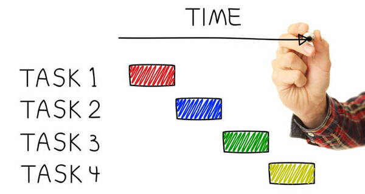

# 4-1 Create Development Plan

Before you start developing a digital prototype of your game design, your team needs to create a plan to specify what you need to develop, what tasks are involved, how long each task should take, etc.

During the development of the digital prototype of your game, your Project Manager will track your team's progress and any problems that arise.

## Value-Driven Approach

When managing a project, the quality and value of the completed work is constrained by the project's scope, schedule, and resources.

* **Scope** represents the amount of work to be completed, such as the features and requirements for a product.
* **Schedule** represents the amount of time available to complete the work.
* **Resources** represent the amount of people \(and money\) available to complete the work.

A change in any one of these factors affects the other factors, as well as the quality and value of the completed work.

* **Quality** can be measured internally by your team. Does the completed work meet your criteria and expectations?
* **Value** has to be measured externally with your target users. Does the completed work provide value to the users by meeting their needs and expectations?

For example, if you increase the scope of a project \(add more work\), then you most likely need to increase the schedule \(add more time\), increase the resources \(add more people or money\), or increase both — in order to successfully complete the project and maintain the desired quality and value.

For this project — as is true for other technology projects that follow a [Lean](https://en.wikipedia.org/wiki/Lean_software_development) or [Agile](https://en.wikipedia.org/wiki/Agile_software_development) development cycle — you have a **fixed schedule** \(limited amount of time\) and **fixed resources** \(limited number of people\).

Therefore, given these limits, your team needs to **estimate the scope of work** that's possible to complete, based on the quality you want to produce and the value you want to provide.

## Define the Minimum Valuable Product

Your team's game design may have many features and requirements. However, it might not be possible to include all of these in your digital prototype based on the limited schedule and resources you have available. Therefore, your team needs to decide which features and requirements to actually include in this initial version of your game.

Many designers refer to this process of estimating the scope for an initial product as defining the **Minimum Valuable Product** \(MVP\).

Be aware that [Minimum Valuable Product](https://design.org/blog/the-wrong-and-right-way-to-build-an-mvp/) does not mean providing the lowest possible value or providing an incomplete product. Instead, it means defining the mininum set \(i.e., the core set\) of functions and features for a product that still provides value to your target users.

The MVP still needs to be useful, usable \(easy-to-understand and easy-to-use\), and provide a desirable user experience. The MVP simply has a limited set of functions and features — but what it does include should still be valuable to the target users.

* If your target users find your MVP to be valuable, then they will use it \(and buy it\) — and you can add other functions and features \(to provide even more value\) in the next version of the product.
* On the other hand, if your target users do not find your MVP to be valuable, then you have an opportunity to improve it before you've invested too much time and resources.

So your team will need to review its game design document and decide what's the MVP version of your game that's possible to create with the limited amount of time and people you have available.

## Track Progress using Schedule

One of the responsibilities of the Project Manager is to track the team's progress to ensure tasks are completed on time.

A **project schedule** is created and used to list each task, its estimated duration, its due date, who it is assigned to, its start date, its current status, etc.

A common method to record the current status of a task is to estimate what percentage of the task is completed, such as: 0% \(not started\), 20%, 40%, 60%, 80%, 100% \(completed\).

The entire team is responsible for following the schedule and providing information to keep it updated. The Project Manager is responsible for ensuring the team stays on schedule — and for helping the team get back on schedule if tasks fall behind.

If a task is behind schedule, the Project Manager leads a team discussion to figure out the best way to get the task back on track, such as:

* assigning additional people to help with the task
* adjusting the task due date to add more time
* reducing or changing the scope of the task
* deferring an issue affecting the task
* etc.

## Track Problems using Issues Log

Another responsibility of the Project Manager is to track and resolve any problems that arise during the project.

An **issues log** is used to list each issue, its priority, who is assigned to work on it, what actions have been taken, its current status, etc.

A simple method to record the current status of an issue is to identify it as: Open, Closed, or Deferred.

* An **open** issue still needs to be resolved.
* A **closed** issue has been fixed and resolved.
* A **deferred** issue has been placed on hold \(to be fixed in the future, if possible\).

If an issue arises, the Project Manager leads a team discussion to figure out what actions to take to try to resolve the issue, such as:

* identify steps to try that might fix issue
* gather additional information that may help understand or fix issue
* get help from other people that may know how to fix issue
* defer the issue \(if it has minimal impact on product value, if it will take too much time to fix, etc.\)
* etc.

### YOUR TASK

1. Each team member should preview his or her upcoming assignments:
   * **Project Manager** should review the rest of this assignment
   * **Programming Lead** should preview assignment [4-2 Code Game in Iterative Stages](4-2-code-game-in-iterative-stages.md)
   * **Art Lead** should preview assignment [4-3 Create Art and Sound for Game](4-3-create-art-and-sound-for-game.md)
   * **Research Lead** should preview assignment [4-4 Create Marketing Website for Game](4-4-create-marketing-website.md)
2. Define your team's Minimum Valuable Product.
   * Identify and prioritize the core set of features in your game design required to create an initial version of your game that meets your targeted gaming motivations and player experience goals.
   * You can list or describe the MVP at the end of your game design document.
3. Your team will use [this spreadsheet as your Schedule Tracker and Issues Log](https://drive.google.com/open?id=1Ye6nydqnQa7zJ-cbuJcthE-LwppEh0HRQy4L2lRB2HM) \(which are listed on separate tabs\). The Schedule Tracker has been partly completed — a set of generic tasks has been entered that should be sufficient for your project. **Your team needs to enter some additional information into the Schedule Tracker**:
   * Your team will have several weeks of class time to complete Phase 4. Your teacher will identify the specific deadline. Enter this deadline at the top of the schedule.
   * Estimate the duration \(in class periods\) to complete each task. \(Some tasks already have estimated durations entered that should be sufficient.\)
   * Based on the estimated durations and sequence of tasks, set initial due dates for each task. \(Keep in mind that some tasks cannot be started until a listed precursor task is completed first.\)
   * Assign each task to one or more team members. Remember that different people will work on different tasks at the same time \(though some tasks cannot be started until its precursor task is completed\). Some tasks might need more than one person \(if you have extra people available\).
4. During development \(assignments 4-2, 4-3, 4-4\), the Project Manager should track the team's progress and any problems that arise:
   * Make sure tasks are on track and completed on time by updating the **Schedule Tracker** \(with start dates, current status, completed dates\)
   * Make sure any issues that arise are recorded and resolved in a timely basis by updating the **Issues Log**
   * It is recommended to briefly check in with the team either on a daily basis or multiple times per week \(such as Monday, Wednesday, Friday\)
   * Make sure completed work has the intended features, quality, and value required for your MVP
   * Assist other team members with tasks as needed to keep the project on track

