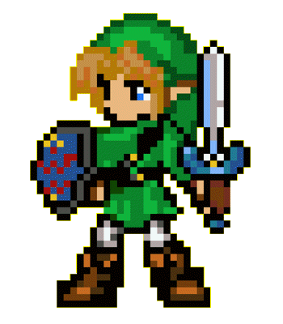

# 4-3 Create Art and Sound for Game

Your team's Art Lead will lead the creation of the art and sound for your video game. You'll need to gather or create each of the visual and audio assets needed for your game.

**Visual assets** might include:

* Background images \(either static images or scrolling tilesprites\)
* Spritesheets for animated characters
* Images \(or spritesheets\) for game objects and user interface elements \(icons, etc.\)
* Tileset \(if using a [tilemap](https://photonstorm.github.io/phaser-ce/Phaser.Tilemap.html) to create your level\)

**Audio assets** might include:

* Sound effects
* Background music
* Voice-over tracks

It may take more time than you expect \(or have available\) to gather and create all the assets, so it will be important to know exactly what you need and to prioritize certain assets over others \(in case you cannot find or create all the desired assets in time\).

In addition, the Art Lead will need to provide your Programming Lead with a **scale map of the game's level** and a **scale layout of the game's user interface**. If necessary, use your concept sketches and paper prototype to help create these scale drawings.

The Art Lead will also need to work with your Programming Lead to:

* add the visual and audio assets into the game
* verify the layout and appearance of the game level and user interface \(and make any necessary changes\)
* add any necessary visual effects into the game \(such as: parallax, particles, tweens, etc.\)

## YOUR TASK

1. If not already done so, provide your team's Programming Lead with:
   * **scale map of the game's level** \(game world\) that shows each object, its position, and its size \(if needed, include a map key to identify the objects\)
   * **scale layout of the user interface** \(within game display\) that shows what information is displayed \(text, icons, etc.\), its position, and its size
   * Use graph paper to create the scale drawings:
     * [Graph Paper with Small Squares](https://drive.google.com/open?id=0B8MTiM_lFG9TN0taLXdUdEF5OVk)
     * [Graph Paper with Large Squares](https://drive.google.com/open?id=0B8MTiM_lFG9TMXJ4WFFaWl9iZTA) 
2. **Determine what assets are needed for your game**, their priority, and whether to find or create them.
   * Refer to the "_Artistic Design Elements \(Aesthetics\)_" section in your game design document.
   * Make separate lists of all the **visual assets** and all the **audio assets** needed for the game.
   * Within each list, determine the **priority** \(importance\) of each asset, so you can decide the order in which you should find or create them.
   * For each asset, determine whether you'll try to **find** it — or will you **create** it.
3. **Find or create the assets**.
   * Review the Project References for [Visual Assets](../project-references/visual-assets.md) and [Audio Assets](../project-references/audio-assets.md) for help
   * You might need **multiple** team members finding or creating assets.
4. Work with your team's Programming Lead to **have the assets added into the game**.
   * Be sure the asset file names make it easy to identify each asset. If necessary, rename the files to be more clear.
   * Upload the asset files into the **assets/images** subfolder or **assets/sounds** subfolder of your team's game folder.
   * For each spritesheet, the Programming Lead will need to know the frame width and height, which frames to use for each animation sequence, what speed \(frames per second\) to play the animation, whether the animation should loop, and when to play each animation.
   * For each audio file, the Programming Lead will need to know when the sound should be played \(and whether it should loop\). After adding the sounds, you'll have to test them in the game to verify what volume \(between 0-1\) to use for each sound.
5. Work with the Programming Lead to **verify the layout and appearance of the game level and user interface** — and help make any necessary changes.
6. Work with the Programming Lead to **add any necessary visual effects** into the game \(such as: tilesprite scrolling, background parallax, particle effects, tweens, camera shake, camera flash, camera fade, tint colors, slow motion, etc.\).
   * For each visual effect, the Programming Lead will need to know what the effect should look like — as well as when, where, and how long the effect should occur.

