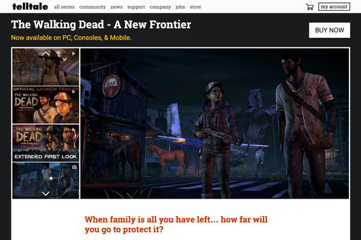

# 4-4 Create Marketing Website

Most entrepeneurs or companies create a website to help promote and market new products. Sometimes this is done as a webpage on a crowdfunding website \(such as [Kickstarter](https://www.kickstarter.com/), [Indiegogo](https://www.indiegogo.com/), etc.\) — other times, this is done as a webpage or mini-site on a company website.

Your team's Research Lead will create a one-page marketing website for your video game. This website will be made **public** to allow more people to learn about your game and play your digital prototype.

Your team's website should briefly explain or show:

* Game Title
* Marketing Tagline for Game
* Game's Premise and Setting
* Game's Characters and Story \(if applicable\)
* Game's Objective and Conflict/Challenge
* Basic Gameplay and Gameplay Progression
* Link to Digital Prototype \(so visitors can play game\)
* Names and Roles of Team Members

Be sure to incorporate visuals into your website, possibly including:

* Concept Sketches of Game World
* Concept Sketches of Characters
* Photos or Video of Paper Prototype
* Completed Game Art, such as Character Sprites, etc.
* Screenshots of Completed Game
* Demo Video of Gameplay

Be sure to design the content and style of your website to **appeal to your target player persona**. Think about ways that your website can communicate \(directly or indirectly\) the gaming motivations and player experience goals provided by your game.

## YOUR TASK

1. **Gather and edit the content** \(text, images, etc.\) for your team’s marketing website.
   * Your team's game design document should already contain much of the text you need. If necessary, edit or revise this text for the website.
   * Be sure to structure your content \(with section headings, etc.\) to make it easy for people to follow or scan the content.
   * Be sure your content is clear, concise, engaging, and professional.
2. **Determine the layout and style** for your team's one-page website.
   * For example, create a wireframe showing the layout of the content, and decide on the visual style for the content \(fonts, colors, etc.\).
   * Be sure your layout and style is clear and engaging — and reinforces your game's theme and visual design.
3. **Construct the website** using a tool such as [Google Sites](https://sites.google.com/create?usp=drive_web) \(available within Google Drive – if needed, Google has a [Get Started with Sites](https://gsuite.google.com/learning-center/products/sites/get-started/) guide\) – or code the website directly using HTML and CSS.
   * If necessary, include temporary placeholders for images or videos that aren't ready yet \(screenshots, sprites, demo video, etc.\). Be sure to replace them later with the final visuals, in order to complete the website.
   * Have other members of your team review the website for possible improvements to make.

In a later assignment, your team will evaluate the website by testing it with users.

