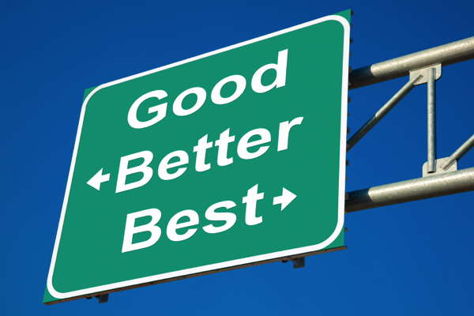

# 5-3 Analyze Evaluation Data to Improve Solution

Your team needs to analyze the feedback and responses from the evaluations of your game and marketing website to determine what is working well and what could be improved.

If time allows, your team will implement improvements as feasible.

## YOUR TASK

1. Review the feedback notes and survey responses from all the participants that evaluated your game. Analyze this evaluation data to summarize the strengths of your game and any issues that might require improvements. Record the summary of your evaluation findings in [this document](https://drive.google.com/open?id=1tRdY77GphvRFY4wjL16LFTNHUHAysfb8S-Cn57iV_Fs).
2. Repeat the process to create a separate summary of evaluation findings for your marketing website.
3. Based on the time available, use your evaluation findings to implement improvements \(as feasible\) to your team's game and/or marketing website.

