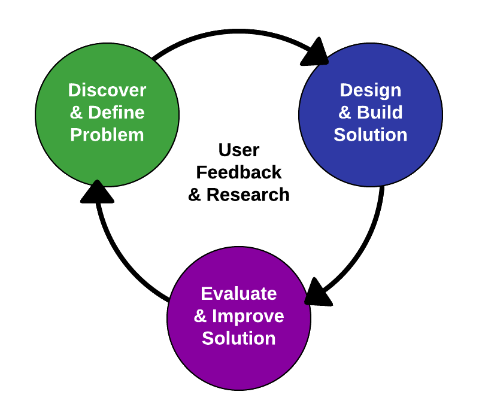

# Project Outline

Your [project challenge](../project-challenge.md) is to design and build a video game that people want to play.

Your team will solve the project challenge by applying a user-centered design process that follows an iterative "Learn-Build-Measure" cycle. In this project, the players of the game are your users.

A key source of information during the game design process will come from **playtesting** — having users play the game in order to get feedback on specific aspects of the game. Playtesting of a game is similar to user testing of an app.

1. **Research Problem Space** - Let's start by exploring what makes a game engaging and motivating to players. Then you'll explore the elements that help define all games. You'll practice using the Phaser JS game engine to code some sample video games. You'll also practice creating sound effects and animated art for games.
   * [Determine your gamer motivation profile](1-1-determine-gamer-motivation-profile.md)
   * [Analyze external motivations in games](1-2-analyze-external-motivations-in-games.md)
   * [Analyze internal motivations in games](1-3-analyze-internal-motivations-in-games.md)
   * [Analyze game design elements](1-4-analyze-game-design-elements.md)
   * [Phaser Practice 1: Code a matching game](1-5-phaser-practice-1-matching-game/)
   * [Phaser Practice 2: Code a top-down game](1-6-phaser-practice-2-top-down-game/)
   * [Phaser Practice 3: Code a side-scrolling game, and create custom assets](1-7-phaser-practice-3-side-scrolling-game/)
2. **Define Problem to Solve** - Your team will identify the gaming motivations and experiences that your game is intended to provide for your target players. Then your team will generate ideas for games that might appeal to these target players. Your team will produce game treatments for several possible game concepts. After evaluating the game treatments with target players, your team will select a final game concept to focus on.
   * [Form project teams](2-1-form-project-teams.md)
   * [Create persona for target players](2-2-create-persona-for-target-players.md)
   * [Generate game ideas](2-3-generate-game-ideas.md)
   * [Refine ideas to create game treatments for top game concepts](2-4-refine-ideas-to-create-game-treatments.md)
   * [Evaluate game treatments to select final game concept](2-5-evaluate-game-treatments.md)
3. **Design Solution & Deliver Proposal** - Create a game design document, representing a conceptual prototype of your game. Then create a paper prototype of your game to playtest, evaluate, and refine your game's design. Present your proposed game design for critique by other teams.
   * [Draft game design document](3-1-draft-game-design-document.md)
   * [Create paper prototype of game](3-2-create-paper-prototype-of-game.md)
   * [Playtest paper prototype to refine game design](3-3-playtest-paper-prototype.md)
   * [Present proposed game design for critique](3-4-present-game-proposal.md)
4. **Build & Develop Solution** - Create a plan to develop a digital prototype of your game design. During development, track your team's progress and any issues that arise. Program your game code in stages, starting with the core game mechanics and iteratively adding, testing, and refining other features. Create and add the visual and audio assets for the game. Create a marketing website to promote your game.
   * [Create development plan for game](4-1-create-development-plan.md)
   * [Code game in iterative stages](4-2-code-game-in-iterative-stages.md)
   * [Create art and sound for game](4-3-create-art-and-sound-for-game.md)
   * [Create marketing website for game](4-4-create-marketing-website.md)
5. **Evaluate & Improve Solution** - After creating your game and marketing website, test them with target players to gather feedback and identify possible improvements to make. If feasible, implement improvements.
   * [Evaluate game with external playtesters](5-1-evaluate-game-with-playtesters.md)
   * [Evaluate marketing website with user testing](5-2-evaluate-marketing-website.md)
   * [Analyze evaluation data to identify possible improvements](5-3-analyze-evaluation-data-to-improve-solution.md)
6. **Reflect & Present Project Results** - At a public poster presentation, explain your team's design process and demonstrate your game. Be prepared to respond to questions. Each team member will reflect on his or her project experience.
   * [Create project poster for public presentation](6-1-create-project-poster.md)
   * [Present project solution to public audience](6-2-present-project-to-public.md)
   * [Write personal reflection on project experience](6-3-write-personal-reflection.md)

