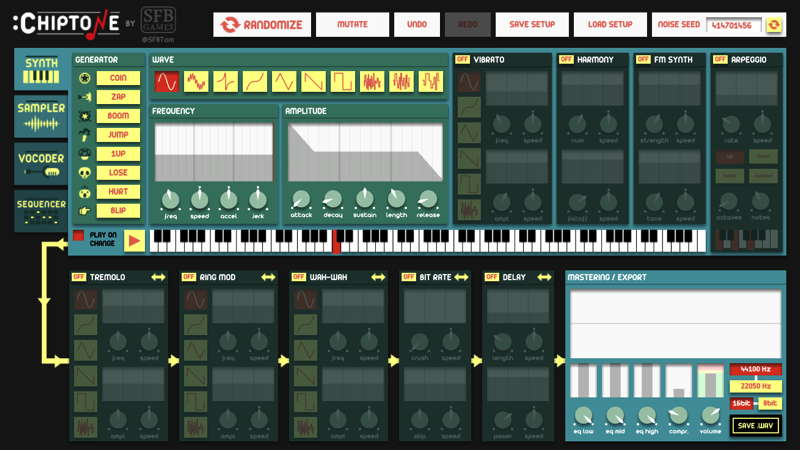

# Audio Assets

This reference section will help with finding and creating audio assets to use in your Phaser games.

Audio assets might include:

* Sound effects
* Background music
* Voice-over tracks

## Finding or Creating Audio Files

* [ChipTone](http://sfbgames.com/chiptone/) can be used to create and save your own sound effects as WAV files.
* [Kenney](http://kenney.nl/assets?q=audio) is a game development studio that offers free audio assets for download. Downloaded assets will be WAV, MP3, or OGG format.
* [Freesound](http://freesound.org/) can be used to search, preview, and download open-source audio files.
  * You will need to create a free account in order to download files.
  * Files will vary in length, format, and size — so check before downloading.
* Other websites or apps may allow you to find, create, or edit audio files.
  * Avoid using copyrighted audio.
  * Be careful when downloading files from unknown \(and potentially malicious\) sites.

## Recommendations for Audio Files

* Audio files can be WAV, OGG, or MP3 format.
* Avoid using audio with large file sizes, as it will slow down your game. Most of your audio files should probably be less than 100 KB. Music files will typically be much larger \(several MB\).
* If necessary, you can convert an audio file from an unsupported format \(AAC, AIFF, etc.\) into WAV or MP3 format using [Zamzar](http://www.zamzar.com/) \(file conversion web app\).
* Be sure the audio file names make it easy to identify each sound. If necessary, rename the files. \(Reminder: File names should not have blank spaces in them.\)
* Be sure your final audio files are uploaded into the **assets/sounds** subfolder of your team's game folder.

## Create Your Own Sound Effects Using ChipTone

[ChipTone](http://sfbgames.com/chiptone) is a web app that allows you to create and download your own sound effects as WAV files.

ChipTone has lots of features, but the best way to learn how to use it is to simply play around with different settings:

* You can change the sound type \(such as: coin, zap, boom, etc.\).
* You can change the wave form. Clicking a second time on the same wave form will reverse its shape.
* You can select a different note \(tone\) on the keyboard.
* You can turn various effects \(vibrato, harmony, etc.\) on or off. Each effect has its own settings that can be adjusted. You can combine effects.

Once you have a sound that you want to use, click the "Save .WAV" button in the lower-right to download the sound file.

**NOTE:** The ChipTone website requires the Adobe Flash plug-in. Google Chrome has Flash built-in, but you might need to grant access for ChipTone to use Flash. If ChipTone doesn't load:

* Open the Settings for Chrome \(click 3-dot icon at upper-right, and select Settings\).
* At the bottom of the Settings, click Advanced.
* In the Privacy and Security section, click Content Settings. Then click Flash.
* Be sure "Allow sites to run Flash" is toggled on \(to the right\).
* Add **sfbgames.com** to your list of allowed websites for Flash.

