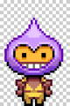
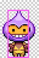

# Physics and Collisions

You can add simulated physics interactions to your game. Objects in the game can move and accelerate. Objects can be affected by gravity and friction. Objects can collide and bounce off each other — and can respond differently based on their relative masses.

The cool thing about simulated physics is that you can make your game world behave however you want. You could change gravity so objects will "fall up" instead of falling down. You could selectively apply gravity only to certain objects — or eliminate gravity entirely.

You can set your game physics to simulate different kinds of actions in different kinds of environments, such as jumping into the air, sliding on ice, swimming in water, flying through space, etc.

**NOTE:** Phaser has several physics systems to choose from. However, this reference section will focus only on the **Arcade Physics** system, which is a good choice for many games.

Arcade Physics has lots of useful physics properties and methods, plus support for weapons \(e.g., shooting or throwing objects such as bullets, lasers, arrows, fireballs, snowballs, etc.\). Arcade Physics is more simplistic than the other physics systems, but it runs much faster as a result.

### Phaser coding references in this section:

* Start Physics System
* Enable Physics on Sprite or Group of Sprites
* Set Physics Body Properties for Sprite
  * Gravity
  * Collide With World Boundaries
  * Velocity
  * Maximum Velocity
  * Acceleration
  * Drag
  * Bounce
  * Mass
  * Immovable
  * Friction
  * Angular Velocity
  * Maximum Angular Velocity
  * Angular Acceleration
  * Angular Drag
* Check for Collide or Overlap of Sprites and Groups
* Change Collision Area of Sprite
* Find Group Member that is Closest or Farthest to Sprite
* Get Distance from Sprite to Object, Location, or Pointer
* Move or Accelerate Sprite Towards Object, Location, or Pointer
* Get Angle Between Sprite and Object, Location, or Pointer
* Move or Accelerate Sprite in Direction of Angle
* Create Platforms that Move Back-and-Forth

In addition, see the [Weapon](weapon.md) section for coding references explaining Arcade Physics weapons.

### Phaser API Documentation:

* [Properties and Methods for Arcade Physics](https://photonstorm.github.io/phaser-ce/Phaser.Physics.Arcade.html)
* [Properties and Methods for Arcade Physics Body](https://photonstorm.github.io/phaser-ce/Phaser.Physics.Arcade.Body.html)

## Start Physics System

In order to use any physics properties and methods in your game, you first need to start the physics system.

To start the Arcade Physics system, add this command at the beginning of your `create()` function:

```javascript
game.physics.startSystem(Phaser.Physics.ARCADE);
```

## Enable Physics on Sprite or Group of Sprites

Physics properties and methods can only be applied to sprites or groups of sprites. However, you must first specifically "enable" physics on each sprite or group that you want to involve in physics interactions.

When you enable physics on a sprite \(or a group of sprites\), it creates a "physics body" for the sprite \(or for each sprite in the group\). You can then get or set the sprite's physics body properties and also check for collisions between the physics bodies of different sprites.

### Enable Physics on Sprite

For example, to enable physics on an individual sprite named `player`:

```javascript
game.physics.arcade.enable(player);
```

Add this command in your `create()` function after adding the sprite \(and before setting any of its physics body properties\).

You will need to enable physics on every sprite that you want to involve in physics interactions.

### Enable Physics on Group of Sprites

For example, to enable physics on a group of sprites named `platformGroup`:

```javascript
platformGroup.enableBody = true;
```

Add this command in your `create()` function after adding the group \(and before setting any physics body properties for members of the group\).

You will need to enable physics for every group that you want to involve in physics interactions.

## Set Physics Body Properties for Sprite

When you enable physics on a sprite or a group of sprites, it creates a "physics body" for the sprite. This sub-section describes the most common physics body properties that you might use in your game.

* You can use **gravity** to pull a sprite in a certain direction \(make it fall down, etc.\), and make the sprite **collide with the world boundaries** \(to simulate colliding with a solid surface\).
* You can use **velocity** or **acceleration** to move a sprite, and set a **drag** that slows it down.
* You can set the **bounce** and **mass** of a sprite to change how it is affected by collisions with other sprites.
* You can make a sprite **immovable** to prevent collisions from changing its position or speed. If the "immovable" sprite is moving \(e.g., moving platform\), you can set a **friction** value that affects other sprites riding on top of it.
* You can use **angular velocity** or **angular acceleration** to rotate a sprite, and set an **angular drag** that slows it down.

### Gravity

We're used to Earth's gravity pulling objects down towards the surface. Earth's gravity affects all objects and causes them to fall at the same rate.

However, in your game world, you have custom control over each sprite's gravity. You can set a sprite's gravity to make it fall up — or to make the sprite get pulled sideways by gravity — or do both. Gravity only affects the sprites you want, and you can set different gravity values for different sprites.

For certain games \(e.g., game using top-down perspective, game set in outer space, etc.\), you might not want your sprites to be affected by gravity \(i.e., you'd just leave the sprite's gravity at its default value of zero\).

You can set a sprite's gravity value for the horizontal direction \(`x`\) and/or the vertical direction \(`y`\). The value represents the acceleration due to gravity measured in pixels per second squared. By default, a sprite's gravity is set to zero in each direction, unless you specifically change it.

* `body.gravity.x` — change this value to add gravity on the sprite in the horizontal direction. Positive values will pull the sprite to the right, and negative values will pull the sprite to the left.
* `body.gravity.y` — change this value to add gravity on the sprite in the vertical direction. Positive values will pull the sprite downwards, and negative values will pull the sprite upwards.

If you want to add a "normal" Earth-type gravity to a sprite, then set a positive value for its `body.gravity.y` property.

For example, to make the `player` sprite fall downward:

```javascript
player.body.gravity.y = 300;
```

### Collide With World Boundaries

You can force a sprite to stay within the game world by making it collide with the world boundaries. Otherwise, it might leave the game world if it is moving \(due to its velocity or gravity\). By default, a sprite will not collide with the world boundaries, unless you specifically tell it to do so.

For example, to force a sprite named `player` to collide with the game world boundaries:

`player.body.collideWorldBounds = true;`

### Velocity

Velocity represents the speed and direction of a sprite:

* A **positive velocity** means the sprite is **moving in a particular direction**.
* A **negative velocity** means the sprite is **moving in the opposite direction**.
* A **velocity of zero** means the sprite is **not moving**.

Thus, if you set a sprite's velocity to any non-zero value \(positive or negative\), it will cause the sprite to move.

The velocity is a number representing the sprite's speed in pixels per second. This property is set separately for the `x` and `y` directions:

* `body.velocity.x` — change this value to move the sprite in the horizontal direction. Positive values will move the sprite to the right, and negative values will move the sprite to the left. Larger numbers \(whether positive or negative\) move the sprite faster.
* `body.velocity.y` — change this value to move the sprite in the vertical direction. Positive values will move the sprite down, and negative values will move the sprite up. Larger numbers \(whether positive or negative\) move the sprite faster.

For example, to make the `player` sprite move to the left:

```javascript
player.body.velocity.x = -200;
```

* `-200` represents the speed in pixels per second. The negative value represents moving to the left. Change this value as needed.

**NOTE:** Once a sprite is given a non-zero velocity, it will keep moving at that speed and direction unless something else causes the velocity to change.

* For example, if you were creating a side-scrolling endless runner game, you could set a positive value for `player.body.velocity.x` in the `create()` function to make the player move to the right at a constant speed. Then your `update()` function might only give the player the option to move up and down by changing the `player.body.velocity.y` value.

You can also get \(i.e., read\) the values to check the speed and/or direction of a sprite.

For example, to determine if the `player` sprite is moving to the left or right \(or not moving at all\):

```javascript
if (player.body.velocity.x < 0) {
    // player moving to left

}
else if (player.body.velocity.x > 0) {
    // player moving to right

}
else {
    // player not moving (velocity.x == 0)

}
```

### Maximum Velocity

You can set a maximum velocity for a sprite to set a limit on how fast it can move. This is typically done in the `create()` function.

The maximum velocity is set as a number representing the maximum speed in pixels per second. This property is set separately for the `x` and `y` directions:

* `body.maxVelocity.x`
* `body.maxVelocity.y`

For example:

```javascript
player.body.maxVelocity.x = 500;
```

It is common to use the same value for both directions, so you can also set both directions at the same time. For example, to set a maximum velocity for a sprite named `player`:

```javascript
player.body.maxVelocity.setTo(500, 500);
```

* `500, 500` represent the values for the `x` and `y` directions \(in that order\). If you only list one number, then it will use that same value for both directions. Change these numbers as needed.

### Acceleration

Acceleration is the rate of change in a sprite's velocity:

* A **positive acceleration** means the sprite is **speeding up**.
* A **negative acceleration** means the sprite is **slowing down**.
* An **acceleration of zero** means the sprite is maintaining the **same speed**.

Acceleration is a number representing the sprite's change in speed in pixels per second. This property is set separately for the `x` and `y` directions:

* `body.acceleration.x` — change this value to change the sprite's velocity in the horizontal direction. Positive values will speed up the sprite, and negative values will slow down the sprite. Larger numbers \(whether positive or negative\) change the speed more quickly.
* `body.acceleration.y` — change this value to change the sprite's velocity in the vertical direction. Positive values will speed up the sprite, and negative values will slow down the sprite. Larger numbers \(whether positive or negative\) change the speed more quickly.

For example, to accelerate a sprite named `player` in the horizontal direction:

```javascript
player.body.acceleration.x = 100;
```

In the example above, if the `player.body.velocity.x` were initially zero \(not moving\), then after 1 second its velocity would be 100 pixels per second, after 2 seconds it would be 200, after 3 seconds it would be 300, etc.

**NOTE:** If you keep applying an acceleration, it will continue to change the sprite's velocity:

* **Example 1:** A sprite initially has a velocity of zero \(not moving\). Applying a positive acceleration will increase the sprite's velocity \(causing it to start moving\). Continuing to apply a positive acceleration will continue to increase the sprite's velocity \(making it move faster over time\).
* **Example 2:** A sprite initially has a positive velocity \(moving\). Applying a negative acceleration will decrease the sprite's velocity \(making it slow down\). Continuing to apply a negative acceleration will continue to decrease the sprite's velocity \(making it slow down further\) until it reaches zero \(stops moving\) and then becomes negative \(moving again but now in the opposite direction\).

### Drag

Drag represents a negative acceleration that slows down the sprite when it is moving. Drag is a type of friction also referred to as air resistance \(or fluid resistance if moving in a liquid\).

Drag only affects the sprite when it is moving. If the sprite is not moving \(velocity is zero\), then drag will not affect it.

Drag is a number representing the sprite's reduction in speed in pixels per second squared. This property is set separately for the `x` and `y` directions. By default, a sprite's drag is set to zero in each direction unless you specifically change it.

* `body.drag.x` — reduces the sprite's velocity in the horizontal direction when the sprite is moving
* `body.drag.y` — reduces the sprite's velocity in the vertical direction when the sprite is moving

For example, to set the horizontal drag of the `player` sprite:

```javascript
player.body.drag.x = 25;
```

It is common to use the same value for both directions, so you can also set both directions at the same time. For example:

```javascript
player.body.drag.setTo(25, 25);
```

* `25, 25` represent the values for the `x` and `y` directions \(in that order\). If you only list one number, then it will use that same value for both directions. Change these numbers as needed.

The effects of drag are most noticeable if your game changes the sprite's speed by using acceleration \(instead of by setting a specific velocity value\).

### Bounce

You can set the `bounce` property for a sprite's physics body, which affects its rebound velocity after colliding with another physics body \(i.e., another sprite\).

The `bounce` property typically uses a value between 0-1. A value of 0 results in no bounce after a collision. A value of 1 results in a perfectly elastic bounce, where the sprite bounces backward from a collision without losing any velocity. A value of 0.5 results in the sprite bouncing backwards with only 50% of its original velocity.

However, you can also set the `bounce` to a value greater than 1, which will actually cause the sprite to gain velocity whenever it bounces. A value of 1.25 would result in the sprite bouncing backwards with 125% of its original velocity. This could be an interesting feature for certain games.

You can set a sprite's bounce value for the horizontal direction \(`x`\) and/or the vertical direction \(`y`\). By default, a sprite's bounce is set to zero in each direction unless you specifically change it.

* `body.bounce.x` — change this value to add a bounce to the sprite in the horizontal direction. You would typically use a value between 0-1 \(but can use a higher value if desired\).
* `body.bounce.y` — change this value to add a bounce to the sprite in the vertical direction. You would typically use a value between 0-1 \(but can use a higher value if desired\).

For example, to give the `player` sprite a small bounce effect in the vertical direction:

```javascript
player.body.bounce.y = 0.2;
```

You can also set both directions at the same time. For example, to make a sprite named `pinball` have perfectly elastic bounces \(without losing any velocity\):

```javascript
pinball.body.bounce.setTo(1, 1);
```

* `1, 1` represent the values for the `x` and `y` directions \(in that order\). If you only list one number, then it will use that same value for both directions.

### Mass

You can set the mass of a sprite \(basically the "weight" of the sprite\). The mass will affect how the velocity of the sprite changes after a collision because Phaser physics systems conserve momentum during collisions \(just like real-life physics\).

Momentum is calculated as an object's mass multipled by its velocity. When objects collide, they transfer kinetic energy, which can cause one object to slow down while the other object speeds up. These changes in speed are affected by the masses of the objects and their velocities before the collision.

The conservation of momentum means that the total momentum of objects before a collision is equal to the total momentum of the objects after the collision.

Every sprite's mass is set to 1 by default, unless you change it. The value for mass is relative: use a value less than 1 to make a sprite less massive, or use a value greater than 1 to make a sprite more massive.

If you want to add more realistic collisions between objects, then set different values for their masses.

For example, to set the mass of a sprite named `player`:

```javascript
player.body.mass = 2;
```

This would make the `player` sprite have 2 times the mass of other sprites \(if they still have the default mass of 1\).

### Immovable

A sprite that is set as "immovable" will not be affected by collisions \(meaning its position and velocity will not be changed if something else collides with it\).

Platforms, walls, and similar types of objects are typically set to be immovable. If you **didn't** set these to immovable, then they would move if something collided with them, such as the player jumping onto a platform or the player running into a wall. \(Though, collapsible platforms and movable walls might be an interesting feature for certain games.\)

For example, to make a sprite named `platform` immovable:

`platform.body.immovable = true;`

**NOTE:** Despite the name "immovable" — you can make a immovable sprite actually move by setting its velocity, acceleration, or gravity. For example, this would allow you to create moving platforms that the player could jump on and ride.

The best way to understand "immovable" is this:

* An immovable sprite can move itself, but it cannot be moved by other sprites that collide with it.

### Friction

In Arcade Physics, the friction property is only applicable to "immovable" sprites. Friction affects other sprites that are riding on top of a moving "immovable" sprite \(such as a moving platform, etc.\).

Friction is set as a value between 0-1 where 0 represents no friction and 1 represents maximum friction. Friction is set separately for the `x` and `y` directions. By default, an immovable sprite's friction is set to 1 for the `x` direction and 0 for the `y` direction, unless you specifically change them.

* `body.friction.x` \(defaults to 1\)
* `body.friction.y` \(defaults to 0\)

To change the horizontal friction for a sprite named `platform`:

```javascript
platform.body.friction.x = 0.5;
```

Imagine the player sprite jumps on top of a horizontally-moving platform \(set to be "immovable"\):

* If the platform's `body.friction.x` is set to 1, the player will stick to the platform and can ride it. As the platform moves, the player will be carried along at the same speed.
* If the platforms's `body.friction.x` is set to 0, the player can land on the platform but won't stick to it — the platform will slide along beneath the player \(without carrying the player along\) — in order to stay on the platform, the player will eventually have move itself.
* If the platforms's `body.friction.x` is set to 0.5, the player can land on the platform, but it will be less sticky. As the platform moves, it will slide a bit underneath the player, only moving the player at half the platform's speed \(and eventually the player will slide off unless the player moves itself\).

The best way to understand friction in Arcade Physics is to try different values in your game to see the effect when another sprite \(such as the player\) lands on a moving "immovable" object.

### Angular Velocity

Angular velocity represents the rotational speed and direction of a sprite:

* A **positive angular velocity** means the sprite is **rotating clockwise**.
* A **negative angular velocity** means the sprite is **rotating counter-clockwise**.
* An **angular velocity of zero** means the sprite is **not rotating**.

Thus, if you set a sprite's angular velocity to any non-zero value \(positive or negative\), it will cause the sprite to rotate.

The angular velocity is a number representing the sprite's rotational speed in degrees per second.

* `body.angularVelocity` — change this value to rotate the sprite. Positive values will rotate the sprite clockwise, and negative values will rotate the sprite counter-clockwise. Larger numbers \(whether positive or negative\) rotate the sprite faster.

For example, to make the `player` sprite rotate counter-clockwise:

```javascript
player.body.angularVelocity = -200;
```

* `-200` represents the rotational speed in pixels per second. The negative value represents counter-clockwise rotation. Change this value as needed.

### Maximum Angular Velocity

You can set a maximum angular velocity for a sprite to set a limit on how fast it can rotate. This is typically done in the `create()` function.

The maximum angular velocity is set as a number representing the maximum speed in degrees per second.

For example, to set a limit on the rotational speed of the `player` sprite:

```javascript
player.body.maxAngular = 500;
```

### Angular Acceleration

Angular acceleration is the rate of change in a sprite's velocity:

* A **positive angular acceleration** means the sprite's rotation is **speeding up**.
* A **negative angular acceleration** means the sprite's rotation is **slowing down**.
* An **angular acceleration of zero** means the sprite's rotation is maintaining the **same speed**.

Acceleration is a number representing the sprite's change in rotational speed in pixels per second.

`body.angularAcceleration` in degrees per second squared

For example, to accelerate the rotation of the `player`:

```javascript
player.body.angularAcceleration = 100;
```

In the example above, if the `player.body.angularVelocity` were initially zero \(not rotating\), then after 1 second its angular velocity would be 100 pixels per second, after 2 seconds it would be 200, after 3 seconds it would be 300, etc.

**NOTE:** If you keep applying angular acceleration, it will continue to change the sprite's angular velocity:

* **Example 1:** A sprite initially has a angular velocity of zero \(not rotating\). Applying a positive angular acceleration will increase the sprite's angular velocity and cause it to start rotating clockwise. Continuing to apply a positive acceleration will continue to increase the sprite's angular velocity \(making it rotate faster over time\).
* **Example 2:** A sprite initially has a positive angular velocity \(rotating clockwise\). Applying a negative acceleration will decrease the sprite's angular velocity \(making its rotation slow down\). Continuing to apply a negative acceleration will continue to decrease the sprite's angular velocity \(making it slow down further\) until it reaches zero \(stops rotating\) and then becomes negative \(rotating again but now in the counter-clockwise direction\).

### Angular Drag

Angular drag represents a negative acceleration that slows down the player when it is rotating. Angular drag is a type of friction also referred to as air resistance \(or fluid resistance if rotating in a liquid\).

Angular drag only affects the sprite when it is rotating. If the sprite is not rotating \(angular velocity is zero\), then drag will not affect it.

Drag is a number representing the sprite's reduction in rotational speed in degrees per second squared. By default, a sprite's angular drag is set to zero, unless you specifically change it.

For example, to set the angular drag for the `player` sprite:

```javascript
player.body.angularDrag = 25;
```

The effects of drag are most noticeable if your game changes the sprite's speed by using angular acceleration \(instead of by setting a specific angular velocity value\).

## Check for Collide or Overlap of Sprites and Groups

Phaser's Arcade Physics system has two methods to detect when sprites "touch" each other:

* `collide()` checks to see if two sprites are touching and keeps them separated \(so they don't overlap, as if they were "solid"\) — if one or both of the objects is moving, they can transfer momentum between each other \(e.g., one sprite might speed up while the other slows down, etc.\)
* `overlap()` simply checks to see if two sprites are touching \(but the objects can overlap and move past each other as separate layers\)

The two sprites being checked for `collide()` or `overlap()` can be individual sprites and/or groups of sprites, such as:

* Sprite vs. Sprite
* Sprite vs. Group
* Group vs. Group

For groups, each member of the group is checked individually. You can even check a group against itself. For example, you could check to see if any members of the same group are colliding with each other.

The `collide()` and `overlap()` commands must be placed in your `update()` function, so your game will constantly check them during gameplay.

### Keep Sprites Separated Using Collide

Different sprites can overlap and will move past other as separate layers unless you use a `collide()` statement to keep them separated.

For example, to make the `player` sprite collide with the `enemyGroup`:

```javascript
game.physics.arcade.collide(player, enemyGroup);
```

* `player, enemyGroup` are the names of the two sprites to check for collisions. You can check: sprite vs. sprite, sprite vs. group, group vs. group. Change these to match the names of your sprites or groups.

If two moving sprites collide with each other, they can transfer momentum between each other \(depending on the `mass` and `velocity` of each sprite\), which can change how fast they are moving. Also, they might "pile up" unless you give one or both of them a value for their physics body `bounce` property.

If one of the sprites or groups has been set to `immovable`, then its position or velocity will not be affected when another sprite collides with it. Sprites or groups representing platforms, walls, etc. are typically set to `immovable` and then made to collide with the other sprites or groups.

For example, to make the `player` sprite, `coinGroup`, and `enemyGroup` all collide with the `platformGroup`:

```javascript
game.physics.arcade.collide(player, platformGroup);
game.physics.arcade.collide(coinGroup, platformGroup);
game.physics.arcade.collide(enemyGroup, platformGroup);
```

### Make Members of Same Group Collide

To make members of the same group collide with each other, you can just list the group once:

```javascript
game.physics.arcade.collide(enemyGroup);
```

This command tells the Arcade Physics system to check for collisions between any two members of `enemyGroup`. This will keep the members separated and prevent them from moving past each other.

However, if you do make members of the same group collide with each other, they might "pile up" unless you give each of them a value for their physics body `bounce` property.

### Perform Custom Function When Sprites Collide

Often, you'll want your game to perform certain actions whenever two specific sprites collide with each other.

For example, if the `player` sprite collides with a member of the `coinGroup`, you might want to perform several actions, such as: remove the specific member of the `coinGroup`, play a sound effect, change the player's score, etc.

You can modify the `collide()` command to list the name of a specific custom function that should run whenever a collision occurs between the two sprites. You will have to create the custom function in your game code.

The specific sprites involved in the collision will be passed into the custom function as parameters \(variables\), so you can perform actions involving them \(such as: damage one of the sprites, etc\).

For example, to call a custom function when the `player` sprite collides with any member of `enemyGroup`:

```javascript
game.physics.arcade.collide(player, coinGroup, collectCoin, null, this);
```

* `player, coinGroup` are the names of the two sprites to check for collisions. You can check: sprite vs. sprite, sprite vs. group, group vs. group. Change these to match the names of your sprites or groups.
* `collectCoin` is the name of the custom function to run. List the function name without parentheses. You will have to create this custom function in your game. Change this to any unique function name that makes sense for your game.
* `null, this` are additional parameters that you need to list.

Next, you will need to create the custom function by adding it after your `update()` function:

```javascript
function collectCoin(player, coin) {
    // add code to perform actions

}
```

* `collectCoin` is the name of the custom function. Change this to match the name you listed in your `collide()` command.
* `player, coin` are the parameter variables that will be passed into the function by your `collide()` command. These represent the two specific sprites involved in the collision. Change these to names that make sense for your collision. 
  * The parameters are received in the same order as the original sprites or groups are listed in your `collide()` command, so the order of the names matters \(in order to make your code perform the actions you intend\).
  * The parameter names that you use can be different from the original sprite or group names. However, it will be much easier to understand what's happening in the custom function if the names are either identical or similar to the original sprite or group names. \(If the parameter represents a member of a group, then use a name similar to the group — but not the actual group name, which might be confusing.\)
  * Inside the custom function, whatever you do to the parameter variables will affect the original sprites they represent.
    * In this example function, `player` represents the `player` sprite involved in the collision, and `coin` represents the specific member of the `coinGroup` that was involved in the collision. So if the command `coin.kill()` were used inside the custom function, it would remove that specific member of the `coinGroup` from the game world.

For example, the complete code for the `collectCoin()` function might look like this:

```javascript
function collectCoin(player, coin) {
    // add code to perform actions
    coin.kill();
    coinSound.play();
    score += 50;
    scoreText.text = 'Score ' + score;
    player.heal(5);
    healthText.text = 'Health ' + player.health;
}
```

### Perform Custom Function When Sprites Overlap

Sometimes, you want your game to perform certain actions whenever two specific sprites touch each other — but you don't want to separate them by making them collide. This is when you would instead using the `overlap()` method.

For example, if the `player` sprite overlaps with a member of the `checkpointGroup`, you might want to perform several actions, such as: play a sound effect, change the player's score, etc.

In the `overlap()` command, you list the name of a specific custom function that should run whenever an overlap occurs between the two sprites. You will have to create the custom function in your game code.

The specific sprites involved in the overlap will be passed into the custom function as parameters \(variables\), so you can perform actions involving them \(such as: damage one of the sprites, etc\).

For example, to call a custom function when the `player` sprite overlaps with any member of `checkpointGroup`:

```javascript
game.physics.arcade.overlap(player, checkpointGroup, updateCheckpoint, null, this);
```

* `player, checkpointGroup` are the names of the two sprites to check for overlap. You can check: sprite vs. sprite, sprite vs. group, group vs. group. Change these to match the names of your sprites or groups.
* `updateCheckpoint` is the name of the custom function to run. List the function name without parentheses. You will have to create this custom function in your game. Change this to any unique function name that makes sense for your game.
* `null, this` are additional parameters that you need to list.

Next, you will need to create the custom function by adding it after your `update()` function:

```javascript
function updateCheckpoint(player, checkpoint) {
    // add code to perform actions

}
```

* `updateCheckpoint` is the name of the custom function. Change this to match the name you listed in your `collide()` command.
* `player, checkpoint` are the parameter variables that will be passed into the function by your `overlap()` command. These represent the two specific sprites that are overlapping. Change these to names that make sense for your overlap. 
  * The parameters are received in the same order as the original sprites or groups are listed in your `overlap()` command, so the order of the names matters \(in order to make your code perform the actions you intend\).
  * The parameter names that you use can be different from the original sprite or group names. However, it will be much easier to understand what's happening in the custom function if the names are either identical or similar to the original sprite or group names. \(If the parameter represents a member of a group, then use a name similar to the group — but not the actual group name, which might be confusing.\)
  * Inside the custom function, whatever you do to the parameter variables will affect the original sprites they represent.
    * In this example function, `player` represents the `player` sprite involved in the collision, and `checkpoint` represents the specific member of the `checkpointGroup` that was involved in the collision. So if the command `checkpoint.kill()` were used inside the custom function, it would remove that specific member of the `checkpointGroup` from the game world.

For example, the complete code for the `updateCheckpoint()` function might look like this:

```javascript
function updateCheckpoint(player, checkpoint) {
    // add code to perform actions
    checkpoint.tint = 0x00ff00; // change to green
    checkpointSound.play();
    playerCheckpoint = checkpoint.x;
    score += 1000;
    scoreText.text = 'Score ' + score;
}
```

## Change Collision Area of Sprite

By default, the physics body collision area for a sprite is treated as a rectangle the same width and height of the image or spritesheet frames used for that sprite.

Sometimes the image or spritesheet for a sprite includes transparent areas around the outer edges. These transparent areas are counted as part of the sprite's collision area, so it can make collisions look or feel unnatural.

For example, here is an enlarged view of a spritesheet frame used for the `player` sprite in Practice 3.



The gray-and-white checkerboard pattern represents transparent areas in the frame image. \(The checkerboard pattern would not be visible in the game.\)

The original spritesheet frame is 32 pixels in width and 48 pixels in height \(including the transparent areas\). By default, this will be the size of the collision area for this sprite.

However, using this default collision rectangle can result in collisions that look unnatural. For example, during gameplay, the sprite can look like it has completely stepped off the edge of a platform — yet it won't fall off because the sprite's transparent corner is still on top of the platform.

Instead, this sprite would behave more naturally in collisions if its collision area more closely matched its visual appearance, as shown below:



A pink rectangle has been added to show the size and position of a new collision rectangle that would work better for this sprite. \(The rectangle would not be visible in the game.\) This new collision rectangle is 20 pixels in width and 40 pixels in height. It is offset from the sprite's top-left corner by 8 pixels horizontally and 8 pixels vertically, so that it will be better positioned to match the sprite's visual body.

This new collision rectangle would ignore most \(but not all\) of the transparent area. Even this new collision rectangle is not perfect, as some of the sprite's head extends outside of the rectangle. However, overall, this rectangle is a much better match to the visual size of the body.

### Set Size of Collision Rectangle

If necessary, you can change the size and position of the rectangle used to detect collisions of the sprite's physics body. \(This won't change the visual appearance of the sprite.\)

For example, to change the collision size for the `player` sprite:

```javascript
player.body.setSize(20, 40, 8, 8);
```

* `20, 40` represent the width and height \(in pixels\) of the collision rectangle. Change these numbers to match the size you want to use for your sprite.
* `8, 8` represent the horizontal offset and vertical offset \(in pixels\) of the collision rectangle's top-left corner, relative to the top-left corner of the sprite. Change these numbers to position the collision rectangle where you need it to be.

### Set Sprite Collision Area to Circle

You can even change the sprite's collision area to have the shape of a circle, instead of a rectangle. In certain situations, this may make more sense than using a rectangular collision area.

For example, here is a spritesheet frame used for the asteroid sprites in Practice 2.


The spritesheet frame is 40 pixels in width and 40 pixels in height \(including the transparent areas represented by the checkerboard pattern\). By default, this would be the size of the collision area for this sprite.

A pink circle has been added to show the size and position of a new collision area that would work better for this sprite. \(The circle would not be visible in the game.\) This new collision circle is 30 pixels in diameter \(15 pixels in radius\). It is offset from the sprite's top-left corner by 5 pixels horizontally and 5 pixels vertically, so that it will be better positioned to match the sprite's visual body.

For example, to change the collision size for a `asteroid` sprite:

```javascript
asteroid.body.setCircle(15, 5, 5);
```

* `15` represents the radius \(in pixels\) of the collision circle. Change this number to match the size you want to use for your sprite.
* `5, 5` represent the horizontal offset and vertical offset of the collision circle, relative to the top-left corner of the sprite. Change these numbers to position the collision circle where you need it to be.

**WARNING:** In some games, changing a sprite's collision area to be a circle can result in unusual `bounce` effects if it collides with a sprite that has a rectangular collision area. Even if the sprite visually looks like a circle, sometimes the best way to get natural-looking collisions is to use a rectangular collision area for the sprite.

## Find Group Member that is Closest or Farthest to Sprite

Arcade Physics has methods to find the specific member in a group that is closest or farthest to a target sprite \(such as the `player` sprite\).

The `closest()` and `farthest()` methods return the specific member as an object, so you must assign the result \(i.e., the specific member\) to a local variable, in order to do something with the result.

### Find Closest Member to Target Sprite

```javascript
var closestMember = game.physics.arcade.closest(sprite, group);
```

For example, you could find the closest enemy to the player and then make that enemy fire a weapon at the player. The code might look like this:

```javascript
var closestEnemy = game.physics.arcade.closest(player, enemyGroup);
enemyWeapon.trackSprite(closestEnemy);
enemyWeapon.fire();
```

### Find Farthest Member from Target Sprite

```javascript
var farthestMember = game.physics.arcade.farthest(sprite, group);
```

## Get Distance from Sprite to Object, Location, or Pointer

Arcade Physics has methods to find the distance \(in pixels\) from a sprite to another object \(another sprite, an image, etc.\), a specific `x, y` location, or the pointer's cursor location.

These distance methods return the distance as a number, so you must assign the result to a local variable, in order to do something with the result.

### Get Distance from Sprite to Another Object

```javascript
var distance = game.physics.arcade.distanceBetween(sprite, targetObject);
```

For example, you could find the distance between the player and a boss enemy, and then make the boss enemy fire a weapon at the player if the distance is below a certain value. The code might look like this:

```javascript
var distance = game.physics.arcade.distanceBetween(player, bossEnemy);
if (distance < 400) {
    if (player.x < bossEnemy.x) bossWeapon.fireAngle = 180;
    else bossWeapon.fireAngle = 0;
    bossWeapon.fire();
}
```

### Get Distance from Sprite to Specific Location

```javascript
var distance = game.physics.arcade.distanceToXY(sprite, x, y);
```

### Get Distance from Sprite to Pointer Location

```javascript
var distance = game.physics.arcade.distanceToPointer(sprite);
```

## Move or Accelerate Sprite Towards Object, Location, or Pointer

Arcade Physics has methods to move or accelerate a sprite towards another object \(another sprite, an image, etc.\), a specific `x, y` location, or the pointer's cursor location.

In the methods, you specify a value for the speed or acceleration to use when moving the sprite:

* **Positive** values will move the sprite **forwards**.
* **Negative** values will move the sprite **backwards**.

**NOTE:** These methods will move or accelerate the sprite in a direct line towards the destination. If you want the sprite to only move horizontally and/or vertically, then you may want to move the sprite using your own code, rather than these methods.

### Move Sprite Towards Another Object

```javascript
game.physics.arcade.moveToObject(sprite, targetObject, speed);
```

For example, you could find the closest enemy to the player and then move that enemy towards the player at a speed of 150 pixels per second. The code might look like this:

```javascript
var closestEnemy = game.physics.arcade.closest(player, enemyGroup);
game.physics.arcade.moveToObject(closestEnemy, player, 150);
```

### Move Sprite Towards Specific Location

```javascript
game.physics.arcade.moveToXY(sprite, x, y, speed);
```

### Move Sprite Towards Pointer Location

```javascript
game.physics.arcade.moveToPointer(sprite, speed);
```

### Accelerate Sprite Towards Another Object

```javascript
game.physics.arcade.accelerateToObject(sprite, targetObject, acceleration);
```

### Accelerate Sprite Towards Specific Location

```javascript
game.physics.arcade.accelerateToXY(sprite, x, y, acceleration);
```

### Accelerate Sprite Towards Pointer Location

```javascript
game.physics.arcade.accelerateToPointer(sprite, acceleration);
```

For example, your game could use the mouse to move the player. Whenever the mouse button is clicked, you could accelerate the player towards the mouse pointer location. The code might look like this:

```javascript
if (game.input.activePointer.isDown) {
    game.physics.arcade.accelerateToPointer(player, 200);
}
```

## Get Angle Between Sprite and Object, Location, or Pointer

Arcade Physics has methods to find the angle \(in radians\) from a sprite to another object \(another sprite, an image, etc.\), a specific `x, y` location, or the pointer's cursor location.

These methods return the angle as a number, so you must assign the result to a local variable, in order to do something with the result.

### Convert Radians to Degrees

Most people are familiar with using degrees to measure an angle. Radians are just another unit that can used to measure an angle \(2π radians = 360°\).

If needed, Phaser has a method to convert radians to degrees:

```javascript
var angleDeg = game.math.radToDeg(angleRad);
```

* `angleRad` represents an angle measured in radians

For example, the fire angle of a weapon uses degrees \(not radians\), so you could get the angle between a sprite and a "target" location, convert the angle from radians to degrees, and then set the weapon's fire angle \(so the weapon is lined up with the "target"\).

### Sprite Rotation Uses Radians

As a reminder, sprites have a property called `rotation` that can be used to rotate a sprite to a specific angle \(in radians\).

```javascript
sprite.rotation = angleRad;
```

* `angleRad` represents an angle measured in radians

For example, once you get the angle between a sprite and a "target" location, you could rotate the sprite to that angle \(so the sprite is lined up with the "target"\).

### Get Angle Between Sprite and Another Object

```javascript
var angleRad = game.physics.arcade.angleBetween(sprite, targetObject);
```

For example, you could get the angle between an enemy and the player, and rotate the enemy to that angle, so the enemy is pointed towards the player. The code might look like this:

```javascript
enemyShip.rotation = game.physics.arcade.angleBetween(enemyShip, player);
```

### Get Angle Between Sprite and Specific Location

```javascript
var angleRad = game.physics.arcade.angleToXY(sprite, x, y);
```

### Get Angle Between Sprite and Pointer Location

```javascript
var angleRad = game.physics.arcade.angleToPointer(sprite);
```

For example, your game could use the mouse to shoot the player's weapon. Whenever the mouse button is clicked, you could get the angle between the player and the mouse pointer location. Then you could set the player's weapon to that angle \(by converting radians to degrees\) and fire the weapon. The code might look like this:

```javascript
if (game.input.activePointer.isDown) {
    var angleRad = game.physics.arcade.angleToPointer(player);
    weapon.fireAngle = game.math.radToDeg(angleRad);
    weapon.fire();
}
```

## Move or Accelerate Sprite in Direction of Angle

Arcade Physics has methods to move or accelerate a sprite in the direction of a specific angle. These methods are most commonly used to move a sprite in the direction of its current angle or rotation.

In the methods, you specify a value for the speed or acceleration to use when moving the sprite in the direction of the angle:

* **Positive** values will move the sprite **forward**.
* **Negative** values will move the sprite **backwards**.

As a reminder, Phaser has two properties for a sprite's angle of rotation:

* `sprite.angle` can be used to get or set the angle of rotation of the sprite, measured in degrees
* `sprite.rotation` can be used to get or set the angle of rotation of the sprite, measured in radians \(2π radians = 360°\)

Both properties do the same thing — they just use different units of measurement.

### Move Sprite in Direction of Angle \(Degrees\)

```javascript
game.physics.arcade.velocityFromAngle(angleDeg, speed, sprite.body.velocity);
```

A common value used for `angleDeg` is the sprite's current angle: `sprite.angle`

For example, you could use the arrow keys to rotate the player and to move the player forward or backwards in the direction of its current angle. The code might look like this:

```javascript
if (arrowKey.left.isDown) {
    // rotate player counter-clockwise
    player.body.angularVelocity = -200;
}
else if (arrowKey.right.isDown {
    // rotate player clockwise
    player.body.angularVelocity = 200;
}
else {
    // stop rotating player
    player.body.angularVelocity = 0;
}

if (arrowKey.up.isDown) {
    // move player forward at current angle
    game.physics.arcade.velocityFromAngle(player.angle, 200, player.body.velocity);
}
else if (arrowKey.down.isDown) {
    // move player backwards at current angle
    game.physics.arcade.velocityFromAngle(player.angle, -200, player.body.velocity);
}
else {
    // stop moving player
    player.body.velocity.setTo(0);
}
```

### Move Sprite in Direction of Angle \(Radians\)

```javascript
game.physics.arcade.velocityFromRotation(angleRad, speed, sprite.body.velocity);
```

A common value used for `angleRad` is the sprite's current rotation: `sprite.rotation`

For example, for each member of an enemy group, you could rotate the enemy towards the player and then move the enemy forward towards the player. The code might look like this:

```javascript
enemyGroup.forEach(function (enemy) {
    enemy.rotation = game.physics.arcade.angleBetween(enemy, player);
    game.physics.arcade.velocityFromRotation(enemy.rotation, 150, enemy.body.velocity);
});
```

### Accelerate Sprite in Direction of Angle \(Radians\)

```javascript
game.physics.arcade.accelerationFromRotation(angleRad, acceleration, sprite.body.acceleration);
```

A common value used for `angleRad` is the sprite's current rotation: `sprite.rotation`

For example, you could get the angle between an enemy and the player, and then accelerate the enemy forward at that angle \(towards the player\) — but without rotating the enemy's body.

```javascript
var angleRad = game.physics.arcade.angleBetween(bossEnemy, player);
game.physics.arcade.accelerationFromRotation(angleRad, 100, bossEnemy.body.acceleration);
```

## Create Platforms that Move Back-and-Forth

You can create platforms that will move back-and-forth in a repeating pattern — either side-to-side or up-and-down. The player's sprite \(and other sprites\) can ride on top of these moving platforms.

You can make a platform move simply by setting a non-zero value for its `body.velocity.x` \(horizontal motion\) or `body.velocity.y` \(vertical motion\).

The instructions below will show you how to add moving platforms into your "regular" platform group, which will also contain your non-moving platforms.

### 1. Create JSON Data Array for Moving Platforms

In your `create()` function, create a JSON array listing data for the moving platforms.

The example JSON array below lists data for 4 moving platforms:

```javascript
// JSON array listing data for moving platforms
var moveData = [
    { x:200, y:450, asset: 'platform-200', direction:'horz', distance:300, speed:100 },
    { x:450, y:200, asset: 'platform-50', direction:'horz', distance:200, speed:-50 },
    { x:300, y:250, asset: 'platform-100', direction:'vert', distance:250, speed:75 },
    { x:700, y:250, asset: 'platform-50', direction:'vert', distance:150, speed: -50}
    // no comma after last item in array
];
```

**Modify the JSON data for your platforms.** Within the array, each platform's data is listed inside curly braces `{ }` using name-value pairs. You can list data for however many moving platforms you want.

For each platform, the following data should be listed:

* `x` represents the initial x-position of the top-left corner of the platform. List the value you want.
* `y` represents the initial y-position of the top-left corner of the platform. List the value you want.
* `asset` represents the name of the image asset key to use for the platform. Different platforms can use different assets, in order to look different and/or have different sizes. List the name of the asset you want to use. Be sure to list the asset name inside quotes.
* `direction` represents whether the platform should move horizontally \(left-and-right\) or vertically \(up-and-down\). List either `'horz'` or `'vert'` based on the motion you want.
* `distance` represents how far the platform should move \(in pixels\) before reversing its motion. Change this to the value you want.
* `speed` represents the speed \(in pixels per second\) at which the platform should move. Change this to the value you want. You can list either a positive value or a negative value, depending on which direction you want the plaftform to be initially moving:
  * For **horizontally-moving** platforms, a positive speed will make the platform initially move to the right, and a negative speed will make the platform initially move to the left. In either case, the platform will reverse direction once it has moved its specified distance.
  * For **vertically-moving** platforms, a positive speed will make the platform initially move downwards, and a negative speed will make the platform initially move upwards. In either case, the platform will reverse direction once it has moved its specified distance.

### 2. Create Moving Platforms Using For Loop and JSON Data

In your `create()` function, create the moving platforms within your "regular" platform group using a `for` loop and the JSON data.

Insert this `for` loop after the commands that add your `platformGroup` and enable physics on the group members. You can insert the `for` loop before or after your code that adds non-moving platforms into the group.

If necessary, change `platformGroup` to the name of your platform group \(only need to change this in the first line of code inside the `for` loop\).

```javascript
// create moving platforms using for loop and JSON data
for (var i = 0; i < moveData.length; i++) {
    var platform = platformGroup.create(moveData[i].x, moveData[i].y, moveData[i].asset);
    if (moveData[i].direction == 'horz') {
        platform.body.velocity.x = moveData[i].speed;             
        if (moveData[i].speed > 0) {
            platform.startPoint = platform.x;
            platform.endPoint = platform.x + moveData[i].distance;
        }
        else {
            platform.startPoint = platform.x - moveData[i].distance;
            platform.endPoint = platform.x;
        }
    }
    else if (moveData[i].direction == 'vert') {
        platform.body.velocity.y = moveData[i].speed;
        if (moveData[i].speed > 0) {
            platform.startPoint = platform.y;
            platform.endPoint = platform.y + moveData[i].distance;
        }
        else {
            platform.startPoint = platform.y - moveData[i].distance;
            platform.endPoint = platform.y;
        }
    }
}
```

After adding all the platforms \(moving and non-moving\), be sure to set the `body.immovable` property to `true` for all members of your platform group.

### 3. Reverse Moving Platforms

In your `update()` function, you need to check each moving platform in your platform group to see if it has moved its specified distance. If so, its direction will be reversed by multiplying its velocity by -1.

If necessary, change `platformGroup` to the name of your platform group \(only need to change this in the first line of code\).

```javascript
// check moving platforms to reverse direction
platformGroup.forEach(function (platform) {
    // see if platform moving horizontally (non-zero velocity.x)
    if (platform.body.velocity.x != 0) {
        // reverse direction if platform moves too far
        if (platform.body.velocity.x < 0 && platform.x < platform.startPoint) platform.body.velocity.x *= -1;
        else if (platform.body.velocity.x > 0 && platform.x > platform.endPoint) platform.body.velocity.x *= -1;
    }
    // see if platform moving vertically (non-zero velocity.y)
    else if (platform.body.velocity.y != 0) {
        // reverse direction if platform moves too far
        if (platform.body.velocity.y < 0 && platform.y < platform.startPoint) platform.body.velocity.y *= -1;
        else if (platform.body.velocity.y > 0 && platform.y > platform.endPoint) platform.body.velocity.y *= -1;
    }
});
```

This code can be inserted anywhere in your `update()` function, but it might make sense to place it towards the end after your `collide()` statements and player input actions.

