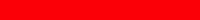
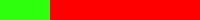

# Sprites, Animations, and Health

You can add a special type of image object called a **sprite** to your game world. Sprites are used for characters and other game objects that need to move and interact with each other.

Sprites are basically image objects that have additional properties allowing for animations, simulated physics interactions \(moving, falling, colliding, etc.\), and simulated life \(gaining health, losing health, being killed, etc.\).

A sprite can be created from a regular image, but an animated sprite will need to use a special type of image called a **spritesheet**, which is a set of identical-sized smaller images \(called frames\) that have been combined into one large image \(which usually has a transparent background\).


**Example spritesheet image consisting of 9 frames**

At any given moment during gameplay, a sprite only displays one possible frame from its spritesheet. By rapidly changing which frame is displayed, the game can animate the sprite to create the illusion that it is moving or changing.

### Phaser coding references in this section:

* Load Spritesheet
* Add Sprite
* Change Anchor for Sprite Position
* Get Current Position of Sprite
* Change Position of Sprite
* Rotate Sprite to Angle
* Add Animations to Sprite
* Play Animations
* Display Specific Sprite Frame
* Hide Sprite \(and Unhide\)
* Remove Sprite \(Kill\)
* Set Sprite Lifespan
* Set Sprite Health
* Damage or Heal Sprite
* Set Maximum Health for Sprite
* Recycle Dead Sprite \(Revive or Reset\)
* Run Function When Sprite Killed
* Create Health Bar
* Create Lives Counter

### Phaser API Documentation:

* [Properties and Methods for Sprite](https://photonstorm.github.io/phaser-ce/Phaser.Sprite.html)
* [Properties and Methods for Animation Manager](https://photonstorm.github.io/phaser-ce/Phaser.AnimationManager.html)

## Load Spritesheet

Each spritesheet image file \(also referred to as an asset\) must be loaded into the game's memory before you can add it to your game world.

```javascript
game.load.spritesheet('dude', 'assets/images/dude.png', 32, 48);
```

The command to load an asset is always placed in your `preload()` function.

* `'dude'` represents an asset key — a key is sort of like a variable name. You decide what string to use for the key, as long as each spritesheet asset has a unique key.
* `'assets/images/dude.png'` represents the folder path and filename of the spritesheet image to load. Change this to match your specific folder path and filename.
* `32, 48` represent the width and height \(in pixels\) of each frame within the spritesheet. Phaser will use these measurements to divide the spritesheet into a set of individual frames. Change these values to match your frame size.

### How to Determine Frame Size

If you're not sure of the size of each frame in a spritesheet, you can easily calculate it from the size of the entire spritesheet.

Spritesheets have their identical-sized frames combined into a grid \(with a certain number of columns and rows\).

1. Determine the width and height \(in pixels\) of the spritesheet image. One way to do this is to open the spritesheet in an image editor \(such as Pixlr Editor, etc.\).
2. Count the number of frames \(**columns**\) contained in the top row across the spritesheet's width. Divide the width of the spritesheet by the number of columns. The result should be a whole number and represents the **width of each frame**.
3. Count the number of frames \(**rows**\) contained in the left column down the spritesheet's height. Divide the height of the spritesheet by the number of rows. The result should be a whole number and represents the **height of each frame**.

## Add Sprite

Once a sprite's asset \(either a "regular" image or a spritesheet\) has been loaded into memory, you can add the sprite to your game world.

Declare a global variable for the sprite, and add the sprite by assigning it to the variable. The command to add a sprite is typically placed in the `create()` function.

```javascript
player = game.add.sprite(100, 500, 'dude');
```

* `player` represents a variable name. Change this to the name of your variable.
* `100, 500` represent the `x` and `y` coordinates where the sprite will be positioned in the game world \(based on the sprite's anchor, which is its top-left corner by default\). Change these values to the position you need.
* `'dude'` represents the asset key of the spritesheet \(or image\) to use. Replace this with your asset key.

## Change Anchor for Sprite Position

The `x` and `y` coordinates of a display object \(text, image, sprite, etc.\) represent the position of the object's **anchor**.

By default, an object's anchor is its top-left corner. However, you can change the anchor for an object \(e.g., to make the object's center become its anchor for positioning\).

The command to change the anchor is typically placed in the `create()` function \(after adding the sprite\).

For example, to change the anchor of a sprite named `player`:

```javascript
player.anchor.set(0.5, 0.5);
```

* The first number represents the horizontal position of the anchor, as a number between 0-1 \(0 = left edge, 0.5 = horizontal center, 1 = right edge\).
* The second number represents the vertical position of the anchor, as a number between 0-1 \(0 = top edge, 0.5 = vertical center, 1 = bottom edge\).

For most sprites, it will make the most sense to set its anchor to its center `(0.5, 0.5)`.

However, for some sprites, it might make more sense to set its anchor to its top-middle `(0.5, 0)` or bottom-middle `(0.5, 1)` — or possibly just leave the anchor as the top-left corner \(the default\).

## Get Current Position of Sprite

The current `x` and `y` coordinates of an sprite's position \(based on its anchor\) are stored as properties of the sprite.

For example, to get the current position of a sprite named `player`:

* `player.x` represents its current `x` coordinate
* `player.y` represents its current `y` coordinate

## Change Position of Sprite

If you need to change the position of a sprite, just change its `x` and/or `y` coordinates.

For example, you could change the position of a sprite named `player`:

```javascript
player.x = 300;
player.y = 500;
```

As another example, you can also move a sprite relative to its current position:

```javascript
player.x = player.x + 5;
player.y = player.y - 5;
```

In the example above, the `player` sprite would be moved 5 pixels to the right and 5 pixels up from its current position.

* Increasing the `x` coordinate moves an object to the right, while decreasing `x` moves the object to the left.
* Increasing the `y` coordinate moves an object down, while decreasing `y` moves the object up.

It will typically be more common that a sprite's position is changed automatically by its [simulated physics properties](physics-and-collisions.md) — e.g., its velocity will cause the sprite to move, its gravity will cause the sprite to fall, etc.

## Rotate Sprite to Angle

You can rotate an image \(around its anchor point\) by changing the value of its `angle` property.

For example, you could rotate a sprite named `player`:

```javascript
player.angle = -90;
```

* `-90` represents the angle in degrees. Change this to any value from -180 to 180. Negative values rotate the image counterclockwise. Positive values rotate the image clockwise.

Phaser also has a property called `rotation` that can be used to get or set the angle of rotation of a sprite. The only difference is that the `rotation` property uses radians for its units, instead of degrees \(2π radians = 360°\).

## Add Animations to Sprite

A spritesheet typically contains one or more sequences of frames that represent animations.

For example, in the spritesheet shown below, the first four frames represent an animation sequence for "running to the left", the fifth frame represents "standing still", and the last four frames represent an animation sequence for "running to the right."


Sprite frames are referenced by an index number, with the first frame numbered as 0, the second frame numbered as 1, the third frame numbered as 2, etc.

You can add an animation sequence to a sprite by specifying which particular frames should be played during the animation.

The command to add an animation is typically placed in the `create()` function \(after adding the sprite\).

For example, to add an animation to a sprite named `player` \(using the spritesheet shown above\):

```javascript
player.animations.add('left', [0, 1, 2, 3], 10, true);
```

* `'left'` represents an animation key — a key is sort of like a variable name. You decide what string to use for the key, as long as each animation has a unique key.
* `[0, 1, 2, 3]` is an array listing the index numbers of the specific spritesheet frames to use for the animation. The frames will be played in the order listed in the array. Change the array to list whichever frame numbers you need \(in the order you need them to play\).
* `10` represents the frame rate for the animation, in frames per second. Depending on your animation, you can change this number to make it play faster or slower.
* `true` indicates that this animation should play repeatedly in a loop. If you don't want an animation to loop, then list `false`.

This just adds the animation into memory, so it's ready to use. The animation won't actually play until you use a command telling it to start playing.

If your sprite has multiple animations, use additional commands to add the other animation\(s\):

```javascript
// add another animation to same sprite
player.animations.add('right', [5, 6, 7, 8], 10, true);
```

## Play Animations

Animations won't play until you tell them to do so.

For example, to play an animation that was added to a sprite named `player`:

```javascript
player.animations.play('right');
```

* `'right'` represents the animation key to play. Change this to your animation key.

### Play Different Animation

To switch the sprite to play a different animation, simply change the animation key:

```javascript
player.animations.play('left');
```

### Stop Animation

To stop a sprite's animation:

```javascript
player.animations.stop();
```

When the animation stops, the sprite will display a random frame from the most recent animation \(whichever frame was being displayed at the exact moment the animation stopped\).

In some cases, you may want to the sprite to display a specific frame when no animation is being played.

## Display Specific Sprite Frame

To make a sprite display a specific frame \(e.g., when no animation is being played\), simply change the `frame` property of the sprite.

```javascript
player.frame = 4;
```

* `4` represents the index number of the frame to display.   Remember that frames are numbered starting with 0 \(so 4 is actually the 5th frame of the spritesheet\). Change this value to the frame index number you want.

## Hide Sprite \(and Unhide\)

There are two properties that can be used to hide a sprite:

* `visible` property
* `exists` property

### Visible Property

You can change a sprite's `visible` property to make the sprite invisible. However, the sprite will still be involved in physics interactions \(moving, falling, colliding, etc.\) because the sprite still exists \(it's just invisible\).

For certain games, invisible sprites could be interesting \(e.g., creating invisible enemies that the player must avoid, etc.\).

For example, to make a sprite named `enemy` invisible:

```javascript
enemy.visible = false;
```

To make the sprite visible again:

```javascript
enemy.visible = true;
```

### Exists Property

You can change a sprite's `exists` property to make the sprite invisible and also prevent it from being affected by any physics interactions. When you want, you can easily make the sprite exist again.

For example, to make a sprite named `powerUp` not exist:

```javascript
powerUp.exists = false;
```

To make the sprite exist again:

```javascript
powerUp.exists = true;
```

## Remove Sprite \(Kill\)

You can remove a sprite from the game use the `kill()` method. This sets the sprite's `visible`, `exists`, and `alive` properties to `false`.

For example, to remove a sprite named `coin`:

```javascript
coin.kill();
```

Killing a sprite removes it from the game, but not from the game's memory. This allows you to recycle "dead" sprites by adding them back into the game using the `revive()` or `reset()` method. For example, this would allow you to give the player's character additional lives — or to replenish resources or enemies that get removed during the course of the gameplay.

## Set Sprite Lifespan

If desired, you can give a sprite a limited lifespan in the game, which will automatically remove \(kill\) the sprite after it has existed for a certain amount of time.

For example, to set a lifespan for a sprite named `powerUp`:

```javascript
powerUp.lifespan = 5000;
```

* `5000` represents duration of the lifespan in milliseconds \(1000 ms = 1 second\). The lifespan begins as soon as the sprite has been added to the game. When the lifespan expires, the sprite will be automatically removed \(killed\).

## Set Sprite Health

If desired, you can give a sprite a certain amount of health. Your game can have various ways for the sprite to gain health \(collecting resource, etc.\) or lose health \(being attacked, etc.\). If the sprite's health reaches zero, the sprite will be automatically removed \(killed\).

This health property is typically used for sprites representing characters \(player, enemies, allies, etc.\) — but it can be used for any sprite you want \(obstacles that must be destroyed, etc.\).

For example, to set the health for a sprite named `player`:

```javascript
player.health = 100;
```

* `100` represents amount of health. Change this to any value that makes sense for your game.

You should set a sprite's initial health value in the `create()` function after adding the sprite. If needed, you can also set a new value in the `update()` function or custom functions if certain conditions or events occur.

## Damage or Heal Sprite

You can increase or decrease a sprite's health using the `heal()` or `damage()` method. You would most likely use these methods in the `update()` function or custom functions if certain conditions or events occur in the game.

### Damage Sprite to Decrease Health

For example, to decrease the health for a sprite named `player`:

```javascript
player.damage(10);
```

* `10` represents amount to decrease the sprite's health. Change this to any value that makes sense for your game.

### Heal Sprite to Increase Health

For example, to increase the health for a sprite named `player`:

```javascript
player.heal(10);
```

* `10` represents amount to increase the sprite's health. Change this to any value that makes sense for your game.

## Set Maximum Health for Sprite

You can also set the maximum health for a sprite \(so it cannot be healed beyond this value\).

For example, to set the maximum health for a sprite named `player`:

```javascript
player.maxHealth = 100;
```

* `100` represents the maximum health value possible for the sprite. Change this to any value that makes sense for your game.

You would typically set a sprite's maximum health value in the `create()` function after adding the sprite and setting its initial health value. If needed, you can also set a new value for the maximum health in the `update()` function or custom functions if certain conditions or events occur.

## Recycle Dead Sprite \(Revive or Reset\)

You can recycle "dead" sprites by adding them back into the game using the `revive()` or `reset()` method. For example, this would allow you to give the player's character additional lives — or to replenish resources or enemies that get removed during the course of the gameplay.

If you have a group of sprites, there is a method to `getFirstDead()` sprite in the group. For more information on this method, see [Groups of Objects](group-of-sprites.md).

### Difference Between Revive and Reset

* **REVIVE:** The `revive()` method adds the dead sprite back into the game at the same position where it was killed \(though you add commands to change the sprite's position\). The sprite will also have the same values for its physics motion \(velocity, acceleration, etc.\) that it had when it was killed \(though you can add commands to change these values\).
* **RESET:** The `reset()` method adds the dead sprite back into the game at a specific position you indicate. It also resets the sprite's physics motion \(velocity, acceleration, etc.\) to zero.

You can use `revive()` and `reset()` for sprites that are supposed to have health \(player, etc.\) or for sprites that don't have health \(resource, etc.\).

### Revive Sprite Without Health

For example, to revive a dead sprite named `powerUp` that isn't supposed to have health:

```javascript
powerUp.revive();
```

### Revive Sprite With Health

For example, to revive a dead sprite named `player` that should have health:

```javascript
player.revive(50);
```

* `50` represents the amount of health to give the sprite when adding it back to the game. Change this to any value that makes sense for your game.

### Reset Sprite Without Health

For example, to reset a dead sprite named `powerUp` that isn't supposed to have health:

```javascript
powerUp.reset(400, 200);
```

* `400, 200` represent the `x` and `y` coordinates where the sprite will be added back into the game world \(based on the sprite's anchor, which is its top-left corner by default\). Change these values to the position you need.

### Reset Sprite With Health

For example, to revive a dead sprite named `player` that should have health:

```javascript
player.reset(100, 500, 50);
```

* The first two numbers `100, 500` represent the `x` and `y` coordinates where the sprite will be added back into the game world \(based on the sprite's anchor, which is its top-left corner by default\). Change these values to the position you need.
* The last number `50` represents the amount of health to give the sprite when adding it back to the game. Change this to any value that makes sense for your game.

## Run Function When Sprite Killed

You can add an `onKilled` event to a sprite to run a function whenever that sprite is killed \(either because the `kill()` method was used on the sprite or because the sprite's `health` reached zero\).

The `onKilled` event should be added in your `create()` function \(after adding the sprite\).

For example, to add an `onKilled` event for the `player` sprite:

```javascript
player.events.onKilled.add(function() {
    // add code to perform actions

});
```

An `onKilled` event is commonly added to the player sprite to end the game — or to add the player back into the game \(e.g., back to the start or at a checkpoint\) depending on how many "lives" the game allows \(endless or limited\).

For example, this code checks to see if the player has any lives remaining. If so, the player is reset back into the game at the last checkpoint position with full health. If the player is out of lives, then it runs a custom function called `gameOver()`:

```javascript
player.events.onKilled.add(function() {
    killSound.play();
    playerLives--; // subtract one life
    if (playerLives > 0) {
        player.reset(checkpointX, checkpointY, player.maxHealth);
        livesText.text = 'Lives ' + playerLives;
        healthText.text = 'Health ' + player.health;
    }
    else gameOver();
});
```

## Create Health Bar

Some games display a health bar to represent how much health the player's character has remaining compared to the maximum possible. The health bar shrinks or expands as the player's health changes.

You can create your own custom health bar by following these steps:

### 1. Create Images for Health Bar

Create an image of a solid rectangle \(whatever color you want\) that will be used as the health bar \(to represent health remaining\). This example will use a green rectangle that is 200px in width and 20px in height:


Create an image of an **identical-sized** solid rectangle \(of a different color\) that will be used as a background bar \(to represent missing health\). This example will use a red rectangle that also is 200px in width and 20px in height:



### 2. Declare Global Variable for Health Bar

Before your `preload()` function, declare a global variable for the health bar:

```javascript
var healthBar;
```

### 3. Load Images for Health Bar

In your `preload()` function, load the two rectangle images:

```javascript
// change asset keys and folder/filenames if necessary
game.load.image('green-bar', 'assets/images/health-green.png');
game.load.image('red-bar', 'assets/images/health-red.png');
```

### 4. Set Health and Maximum Health for Sprite

In your `create()` function, set the values for the initial health and the maximum health for your player's sprite \(after adding the sprite\):

```javascript
// change values if necessary
player.health = 100;
player.maxHealth = 100;
```

### 5. Add Health Bar Images and Text Label

The background bar \(red\) and the health bar \(green\) will be added to the game **at the same position**. However, the background bar will be added first, so it will be stacked behind the health bar.

In your `create()` function, add the background bar by assigning it to a local variable. Then add the health bar **at the same position** by assigning it to its global variable.

You should also add a text label to the left of the bars by assigning it to a local variable.

If your game world is larger than your game display, then be sure to make the images and text label fixed to the camera.

```javascript
// change position if needed (but use same position for both images)
var backgroundBar = game.add.image(300, 20, 'red-bar');
backgroundBar.fixedToCamera = true;

healthBar = game.add.image(300, 20, 'green-bar');
healthBar.fixedToCamera = true;

// add text label to left of bar
var healthLabel = game.add.text(210, 20, 'Health', {fontSize:'20px', fill:'#ffffff'});
healthLabel.fixedToCamera = true;
```

### 6. Scale Health Bar When Sprite Health Changes

When the player's health changes, the width of the health bar is supposed to shrink or expand proportionately. If the health bar shrinks, it will reveal some of the background bar behind it. If the health bar expands, it will cover more of the background bar.

We can make the health bar shrink or expand by changing its `scale` property. The correct value for the scale can be calculated by dividing the player's health by its maximum health value.

* For example, if the player's health is currently 25 and its maximum health value is 100, the current scale for the health bar should be 0.25 \(25/100 = 0.25\), which would look like this:

  

Anytime the player's health changes \(sprite is damaged, healed, revived, or reset\), you need to change the scale for the width of the health bar:

```javascript
healthBar.scale.setTo(player.health / player.maxHealth, 1);
```

This command sets a scale value for the width and height of the health bar:

* `player.health / player.maxHealth` is the calculated scale for the width
* `1` is the scale for the height \(1 = 100% height\)

**HINT:** If desired, you could use these steps to create a scalable bar to represent other elements of your game \(such as: timer bar, progress bar, etc.\).

## Create Lives Counter

Some games display a counter to represent how many lives the player has remaining. This counter could simply be shown as a number. However, in some games, the lives counter is shown as a row of icons representing the individual lives remaining. As the number of lives changes, the number of icons displayed changes.

Games that utilize an icon-based lives counter typically set a relatively low limit \( &lt; 10\) on the maximum number of lives available. \(Otherwise, if the limit is higher, it is probably better to just display an actual number to the player.\)

You can create your own custom icon-based lives counter by following these steps:

### 1. Create Image for Lives Counter

First determine the maximum number of lives that your game will allow the player to accumulate. Next you need to create an image similar to a spritesheet that shows a row of icons representing the maximum number of lives.

For example, here is the image created for the lives counter used in the [Asteroids 2084 game](../../project-outline/1-6-phaser-practice-2-top-down-game/). It shows 5 spaceship icons, which represents the maximum number of lives in this game.


The best way to create an image like this is to find or create an icon representing one life. Determine the width of the icon, and then paste copies of it side-by-side at evenly-spaced widths to create a row of icons. Save this image as your lives counter.

* For example, the spaceship icon is 25px in width \(including the transparent area on both sides\). Copies of the icon were placed side-by-side every 25px, so the final image of 5 icons is 125px in width \(5 × 25 = 125\).

### 2. Declare Global Variables Related to Lives Counter

Before your `preload()` function, declare global variables for the current number of player lives and the maximum number of lives, and assign values to both.

You also need to declare global variables to represent the lives counter image, the width of each lives icon, and a rectangle that will be used to crop the lives counter image:

```javascript
// change numbers for lives and maximum lives if necessary
var lives = 3;  // number of lives at start of game
var maxLives = 5;
var livesCounter, livesIcon, livesCrop;
```

### 3. Load Image for Lives Counter

In your `preload()` function, load the lives counter image:

```javascript
// change asset key and folder/filename if necessary
game.load.image('max-lives', 'assets/images/ship-lives.png');
```

### 4. Add Lives Counter Image and Text Label

In your `create()` function, add the lives counter image by assigning it to its global variable. Also add a text label by assigning it to a local variable. If your game world is larger than your game display, be sure to make the image and text label fixed to the camera.

```javascript
// change position if necessary
livesCounter = game.add.image(650, 20, 'max-lives');
livesCounter.fixedToCamera = true;

// add text label to left of bar
var livesLabel = game.add.text(585, 20, 'Lives', {fontSize:'20px', fill:'#ffffff'});
livesLabel.fixedToCamera = true;
```

### 5. Create Rectangle to Crop Lives Counter

Phaser allows you to apply a rectangular crop to an image. Any portion of the image **outside** the crop rectangle will be hidden from view. The crop is a reversible visual effect — you can adjust the size of the crop whenever needed.

The crop rectangle for the lives counter should:

* be positioned at the top-left corner of the lives counter image
* have a width equal to the number of lives multiplied by the width of a lives icon
* have the same height as the lives counter image \(to show its full height\)

In your `create()` function \(immediately after adding the lives counter image and its text label\), add this code:

```javascript
livesIcon = livesCounter.width / maxLives;
livesCrop = new Phaser.Rectangle(0, 0, lives * livesIcon, livesCounter.height);
livesCounter.crop(livesCrop);
```

* `livesIcon` represents the width of an individual icon in the lives counter image. The icon width is calculated by dividing the width of the entire lives counter image by the maximum number of lives \(i.e., the number of icons in the image\).
* `livesCrop` is the rectangle that will be used to crop the lives counter image:
  * `0, 0` will be the position of the crop rectangle relative to the top-left corner of the image being cropped.
  * `lives * livesIcon` will be the width of the crop rectangle.
  * `livesCounter.height` will be the height of the crop rectangle.
* The `crop()` method applies the crop rectangle to the lives counter image.

### 5. Update Crop When Number of Lives Changes

Anytime the player gains or loses a life \(i.e., anytime the value of `lives` changes\), you need to re-calculate the width of the crop rectangle, and then update the crop of the lives counter image \(to show more or fewer icons\):

```javascript
livesCrop.width = lives * livesIcon;
livesCounter.updateCrop();
```

**HINT:** If desired, you could use these steps to create an icon-based counter to represent other elements of your game \(such as: number of resources remaining, number of achievements earned, etc.\).

