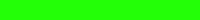

# Timers

You can keep track of the elapsed time \(or remaining time\) in your game. You can also add timers to make certain events occur after a designated amount of time has elapsed.

Event timers work by calling a custom function \(that you create\) once the designated amount of time has elapsed. Your custom function contains whatever actions you want to perform for the event.

For example, your game might have power-ups that give the player a boost in speed for a certain amount of time. Once the player collects a power-up, your game could start a timer so the speed boost will be stopped by a custom function after 10 seconds.

### Phaser coding references in this section:

* Useful Constants for Setting Timers
* Add Timer for Single Event
* Add Timer for Repeated Event
* Add Timer for Looping Event
* Get Elapsed Game Time
* Calculate Elapsed Time Between Events
* Create Count Up Timer \(Elapsed Game Time\)
* Create Countdown Timer \(Game Time Remaining\)
* Start Timer After Specific Key Pressed

### Phaser API Documentation:

* [Properties and Methods for Time](https://photonstorm.github.io/phaser-ce/Phaser.Time.html)
* [Properties and Methods for Timer](https://photonstorm.github.io/phaser-ce/Phaser.Timer.html)

## Useful Constants for Setting Timers

Timers are set in milliseconds \(1000 ms = 1 second\). You can list a specific number \(e.g., `5000` would be 5 seconds\) or a calculated number \(e.g., `1000 * 5` would also be 5 seconds\).

Phaser has two constants that are helpful when setting a timer:

* `Phaser.Timer.SECOND` represents the number of milliseconds in one second \(1000 ms = 1 second\).
* `Phaser.Timer.MINUTE` represents the number of milliseconds in one minute \(60000 ms = 1 minute\).

For example, imagine that you need to set a timer for 2 minutes. Any of these could be used to represent the number of milliseconds in 2 minutes:

* `120000`
* `1000 * 60 * 2`
* `Phaser.Timer.SECOND * 120`
* `Phaser.Timer.MINUTE * 2`

Even though any of those could be used, the last option is probably the easiest to understand when reading the code \(and the least likely for you to make a mistake when typing the code\).

## Add Timer for Single Event

You can set a timer for a single event. When the designated amount of time has elapsed, a custom function will be called to perform whatever actions you decide.

The generic code for setting a single event timer is:

```javascript
game.time.events.add(time, timerEvent, this);
```

* `time` is the amount of time \(in milliseconds\) that should elapse before calling the event function. Change this to any time that you need.
* `timerEvent` is the name of the custom function to run when the timer is completed. List the function name without parentheses. You will have to create this custom function in your game. Change this to any unique function name that makes sense for your game.

If you want the timer to start when the game starts, then set the timer in your `create()` function.

If you want to start the timer at some other point during the game, then set the timer in your `update()` function or in a custom function.

For example, to set a 10 second timer:

```javascript
game.time.events.add(Phaser.Timer.SECOND * 10, timerEvent, this);
```

Then be sure to add your custom function after the `update()` function:

```javascript
function timerEvent() {
    // add code to perform when timer is done

}
```

## Add Timer for Repeated Event

You can set a timer for a repeated event. When the designated amount of time has elapsed, a custom function will be called to perform whatever actions you decide. Then a new timer will be started — this will repeat however many times you specify.

The generic code for setting a repeated event timer is:

```javascript
game.time.events.repeat(time, quantity, timerEvent, this);
```

* `time` represents the amount of time \(in milliseconds\) that should elapse before calling the event function. Change this to any time that you need.
* `quantity` represents the number of times that the timer should repeat itself.
* `timerEvent` is the name of the custom function to run when the timer is completed. List the function name without parentheses. You will have to create this custom function in your game. Change this to any unique function name that makes sense for your game.

If you want the timer to start when the game starts, then set the timer in your `create()` function.

If you want to start the timer at some other point during the game, then set the timer in your `update()` function or in a custom function.

For example, to set a 10 second timer that will repeat itself 5 times:

```javascript
game.time.events.repeat(Phaser.Timer.SECOND * 10, 5, timerEvent, this);
```

Then be sure to add your custom function after the `update()` function:

```javascript
function timerEvent() {
    // add code to perform when timer is done

}
```

## Add Timer for Looping Event

You can set a timer for a looping event. When the designated amount of time has elapsed, a custom function will be called to perform whatever actions you decide. Then a new timer will be started — this will keep repeating in an endless loop throughout the game.

The generic code for setting a looping event timer is:

```javascript
game.time.events.loop(time, timerEvent, this);
```

* `time` represents the amount of time \(in milliseconds\) that should elapse before calling the event function. Change this to any time that you need.
* `timerEvent` is the name of the custom function to run when the timer is completed. List the function name without parentheses. You will have to create this custom function in your game. Change this to any unique function name that makes sense for your game.

If you want the timer to start when the game starts, then set the timer in your `create()` function.

If you want to start the timer at some other point during the game, then set the timer in your `update()` function or in a custom function.

For example, to set a 30 second timer that will keep repeating in a loop:

```javascript
game.time.events.loop(Phaser.Timer.SECOND * 30, timerEvent, this);
```

Then be sure to add your custom function after the `update()` function:

```javascript
function timerEvent() {
    // add code to perform when timer is done

}
```

## Get Elapsed Game Time

Phaser keeps track of how much total time has elapsed \(in seconds\) since the game started. You can get this value and assign it to a variable to do something with the result.

The total elapsed time will be a decimal number representing exactly how many seconds have elapsed since the game started.

### Get Elapsed Time \(Exact\)

If you want to get the exact time that a particular event occurred, you would use this:

```javascript
var time = game.time.totalElapsedSeconds();
```

### Get Elapsed Time \(Rounded\)

If you want to get the elasped time rounded down to the nearest whole second, you would use this:

```javascript
var time = Math.floor(game.time.totalElapsedSeconds() );
```

## Calculate Elapsed Time Between Two Events

You can use global variables to store the exact time that two different events occurred in the game, and then subtract the times to calculate how much time passed between them.

For example, get the time that the first event occurred and store it in a global variable:

```javascript
time1 = game.time.totalElapsedSeconds();
```

Then get the time that the second event occurred and store it in another variable. Subtract the two times to get the amount of time that elapsed between the two events:

```javascript
time2 = game.time.totalElapsedSeconds();
var elapsedTime = time2 - time1;
```

As a more specific example, imagine that your game rewards the player for how fast they progress from one checkpoint to the next. Your game could have an `overlap()` method to detect when the player reaches a checkpoint \(assume that each checkpoint is a member of a group of sprites\). When an overlap occurs, a custom function is called that gets the exact time the event occurred and awards a score point bonus based on how much time elapsed since the previous checkpoint.

For example, some of the code might look like this:

```javascript
// global variables
var prevTime = 0; // time when last checkpoint reached (0 = start of game)
var thisTime; // time when current checkpoint reached 

// NOTE: preload() and create() not shown

function update() {
    // NOTE: other code in update() not shown
    game.physics.arcade.overlap(player, checkpointGroup, checkpointReached, null, this);
}

function checkpointReached(player, checkpoint) {
    // get exact time player reached checkpoint
    thisTime = game.time.totalElapsedSeconds();
    awardTimeBonus(prevTime, thisTime);
    checkpoint.kill(); // remove this checkpoint
}

function awardTimeBonus(time1, time2) {
    var time = time2 - time1;
    if (time < 30) bonus = 5000;
    else if (time < 45) bonus = 4000;
    else if (time < 60) bonus = 3000;
    else bonus = 2000;
    score = score + bonus;
    scoreText.text = 'Score ' + score;
    // update prevTime for next checkpoint
    prevTime = time2;
}
```

## Create Count Up Timer

You can create a "count up" timer to display the elapsed time since the game started.

### 1. Add Text for Elapsed Time

Create a global variable named `timeText` that will be used to display the count up timer.

```javascript
// global variables
var timeText;
```

In your `create()` function, add a text object by assigning it to `timeText`. If you have an extended game world, be sure to make the text stay fixed to the camera view.

```javascript
// if necessary, change position, font size, and fill color
timeText = game.add.text(680, 20, '', { fontSize: '20px', fill: '#ffffff' });
timeText.fixedToCamera = true;
```

### 2. Add Custom Function to Display Elapsed Time

Next you'll add a custom function that get the current elapsed time \(rounded down the nearest second\) and then convert that into minutes and seconds to display on-screen as text.

After your `update()` function, add this custom function:

```javascript
function displayTimeElapsed() {
    var time = Math.floor(game.time.totalElapsedSeconds() );
    var min = Math.floor(time / 60);
    var sec = time % 60;

    if (min < 10) {
        min = '0' + min;
    }
    if (sec < 10) {
        sec = '0' + sec;
    }
    timeText.text = 'Time ' + min + ':' + sec;
}
```

### 3. Call Custom Function in `update()`

Now you just need to call the custom function in your `update()` function, so it will update the count up timer every game loop.

Just include this as the first line of code inside your `update()` function:

```javascript
displayTimeElapsed();
```

## Create Countdown Timer

You can create a countdown timer to display the amount of time remaining in the game \(based on a specified time limit\). The timer starts counting down when the game starts.

You could display the countdown timer as text or as a timer bar. Both options will be provided below.

## Option 1: Display Countdown Timer as Text

### 1. Declare Global Variables for Time Limit, Time Over, and Timer Text

Before your `preload()` function, declare a global variable named `timeLimit` for your countdown timer, and assign it a value representing the number of seconds for the countdown timer \(e.g., `120` would represent a 2 minute countdown timer\). Declare a global variable named `timeOver` that will be used to detect when the countdown timer has reached zero. Also declare a global variable named `timeText` that will be used to display the time remaining.

```javascript
// global variables
var timeLimit = 120; // timeLimit for countdown in seconds
var timeOver = false; // set to false at start
var timeText; // display time remaining
```

### 2. Add Text for Time Remaining

In your `create()` function, add a text object by assigning it to `timeText`. If you have an extended game world, be sure to make the text stay fixed to the camera view.

```javascript
// if necessary, change position, font size, and fill color
timeText = game.add.text(680, 20, '', { fontSize: '20px', fill: '#ffffff' });
timeText.fixedToCamera = true;
```

### 3. Add Custom Function to Display Time Remaining

Next you'll add a custom function that get the current elapsed time \(rounded down the nearest second\) and then convert that into minutes and seconds to display on-screen as text.

After your `update()` function, add this custom function:

```javascript
function displayTimeRemaining() {
    var time = Math.floor(game.time.totalElapsedSeconds() );
    var timeLeft = timeLimit - time;

    // detect when countdown is over
    if (timeLeft <= 0) {
        timeLeft = 0;
        timeOver = true;
    }

    var min = Math.floor(timeLeft / 60);
    var sec = timeLeft % 60;

    if (min < 10) {
        min = '0' + min;
    }
    if (sec < 10) {
        sec = '0' + sec;
    }
    timeText.text = 'Time Left ' + min + ':' + sec;
}
```

### 4. Call Custom Function in `update()`

Now you just need to call the custom function in your `update()` function, so it will update the count up timer every game loop until the time runs out.

Just include this at the beginning of your `update()` function:

```javascript
if (timeOver == false) displayTimeRemaining();
else {
    // add code for when timer runs out
    // player.kill();

}
```

## Option 2: Display Countdown Timer Bar

### 1. Create Images for Timer Bar

Create an image of a solid rectangle \(whatever color you want\) that will be used as the timer bar \(to represent time remaining\). This example will use a green rectangle that is 200px in width and 20px in height:



Create an image of an **identical-sized** solid rectangle \(of a different color\) that will be used as a background bar \(to represent elapsed time\). This example will use a red rectangle that also is 200px in width and 20px in height:


### 2. Declare Global Variable for Timer Bar

Before your `preload()` function, declare a global variable named `timeLimit` for your countdown timer, and assign it a value representing the number of seconds for the countdown timer \(e.g., `120` would represent a 2 minute countdown timer\). Declare a global variable named `timeOver` that will be used to detect when the countdown timer has reached zero. Finally, declare a global variable named `timeBar` for the timer bar:

```javascript
// global variables
var timeLimit = 120; // timeLimit for countdown in seconds
var timeOver = false; // set to false at start
var timeBar; // display time remaining
```

### 3. Load Images for Timer Bar

In your `preload()` function, load the two rectangle images:

```javascript
// change asset keys and folder/filenames if necessary
game.load.image('green-bar', 'assets/images/bar-green.png');
game.load.image('red-bar', 'assets/images/bar-red.png');
```

### 4. Add Timer Bar Images and Text Label

The background bar \(red\) and the timer bar \(green\) will be added to the game **at the same position**. However, the background bar will be added first, so it will be stacked behind the timer bar.

In your `create()` function, add the background bar by assigning it to a local variable. Then add the timer bar **at the same position** by assigning it to its global variable.

You should also add a text label to the left of the bars by assigning it to a local variable.

If your game world is larger than your game display, then be sure to make the images and text label fixed to the camera.

```javascript
// change position if needed (but use same position for both images)
var backgroundBar = game.add.image(300, 20, 'red-bar');
backgroundBar.fixedToCamera = true;

timeBar = game.add.image(300, 20, 'green-bar');
timeBar.fixedToCamera = true;

// add text label to left of bar
var timeLabel = game.add.text(215, 20, 'Time', {fontSize:'20px', fill:'#ffffff'});
timeLabel.fixedToCamera = true;
```

### 5. Add Custom Function to Scale Timer Bar

As the amount of time remaining decreases, the width of the timer bar is supposed to shrink proportionately. When the timer bar shrinks, it will reveal some of the background bar behind it.

We can make the timer bar shrink by changing its `scale` property. The correct value for the scale can be calculated by dividing the time remaining by the time limit.

After your `update()` function, add this custom function:

```javascript
function displayTimeRemaining() {
    var time = Math.floor(game.time.totalElapsedSeconds() );
    var timeLeft = timeLimit - time;

    // detect when countdown is over
    if (timeLeft <= 0) {
        timeLeft = 0;
        timeOver = true;
    }

    timeBar.scale.setTo(timeLeft / timeLimit, 1);
}
```

### 6. Call Custom Function in `update()`

Now you just need to call the custom function in your `update()` function, so it will update the count up timer every game loop until the time runs out.

Just include this at the beginning of your `update()` function:

```javascript
if (timeOver == false) displayTimeRemaining();
else {
    // add code for when timer runs out
    // player.kill();

}
```

## Start Timer After Specific Key Pressed

You can also make your timer wait to start until a specific key is pressed. The player won't be able to perform any other actions until the "start" key has been pressed.

In this example, we'll use the spacebar as the "start" key. Once the game is "started," this same key can be used instead for other normal game actions. For example, some games use the spacebar for actions such as jumping or firing a weapon.

This example will work with a countdown timer or a countup timer - but you'll need to use a slightly modified function for your timer that adjusts for the actual "start time" when the player first pressed the spacebar key.

### 1. Declare Global Variables to Track When Game is Started

Before your `preload()` function, declare a global variable named `started`, and assign it a value of `false` \(later when the spacebar key is first pressed, you'll change this variable to a value of `true`\).

Declare another global variable named `startTime`, and assign it an initial value of zero \(later this variable will be used to store the time when the spacebar key is first pressed\).

Finally, declare a global variable named `spacebar` that will be used to represent the spacebar key.

```javascript
var started = false;
var startTime = 0;
var spacebar;
```

### 2. Add Spacebar Key as Input

Within your `create()` function, make the `spacebar` variable represent user input using the spacebar key.

```javascript
spacebar = game.input.keyboard.addKey(Phaser.KeyCode.SPACEBAR);
```

Again, if you also want to use the spacebar for other player actions \(such as jumping, firing weapon, etc.\) after the game is "started," you'll be able to do so.

### 3. Add If Statements to Check if Game is Started

Within your `update()` function, you'll add some `if` statements that will check whether the variable named `started` has a value of `true` or `false`. These will be added **after** your `game.physics.arcade.collide()` functions \(which are usually listed at the beginning of the `update()` function\).

If `started` has a value of `true`, then the game will updated the time left in the countdown timer and check for any player input to perform normal game actions \(such as moving, jumping, firing weapon, etc.\).

However, if `started` has a value of `false`, then the game will only check to see if the spacebar was pressed.  The game will **NOT** update the countdown timer \(meaning it will act like it is "paused"\), and the game won't allow the player to perform any other actions. The game is simply waiting for the player to press the spacebar.

Once the spacebar is pressed, the game will change the value of `started` to `true`, and store the current game time in the `startTime` variable \(so the timer can adjust itself based on the start time\).

```javascript
	// wait to start game until spacebar pressed
	if (started == false && spacebar.justDown) {
		started = true;
		startTime = game.time.totalElapsedSeconds();
	}

	// once game started, update timer and check for other user input
	if (started == true) {

		// CHECK TIME REMAINING
		if (timeUp) gameOver(); // function to display game over message
    	else displayTimeLeft(); // function to update timer on screen

    	// CHECK PLAYER INPUT
    	// add code to check keys to make player move, jump, fire, etc.

	}
```

### 4. Modify Timer Function

Finally, you'll have to modify your timer function to adjust for the start time \(when the player first pressed the spacebar\).

The custom function for your timer should be placed **after** the `update()` function.

Here's a modified countdown timer function for displaying a shrinking time bar:

```javascript
// modified countdown timer using startTime variable
function displayTimeLeft() {
    var time = game.time.totalElapsedSeconds();
    var timeLeft = startTime + timeLimit - time;
    
    if (timeLeft < 0) {
        timeLeft = 0;
        timeUp = true;
    }
    
    timeBar.scale.setTo(timeLeft / timeLimit, 1);
}
```

If you are using a countup timer, your modified timer function would instead look like this:

```javascript
// modified countup timer using startTime variable
function displayTimeElapsed() {
    var time = Math.floor(game.time.totalElapsedSeconds() - startTime);
    var min = Math.floor(time / 60);
    var sec = time % 60;

    if (min < 10) {
        min = '0' + min;
    }
    if (sec < 10) {
        sec = '0' + sec;
    }
    timeText.text = 'Time ' + min + ':' + sec;
}
```

