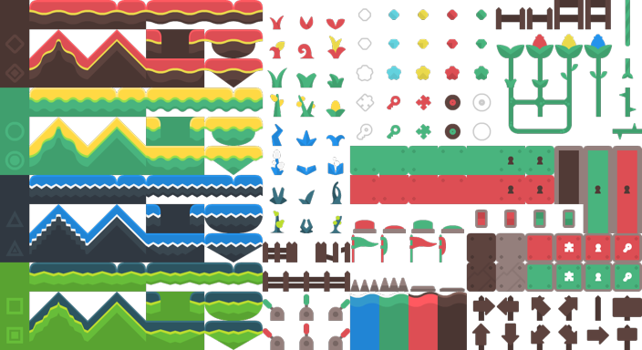
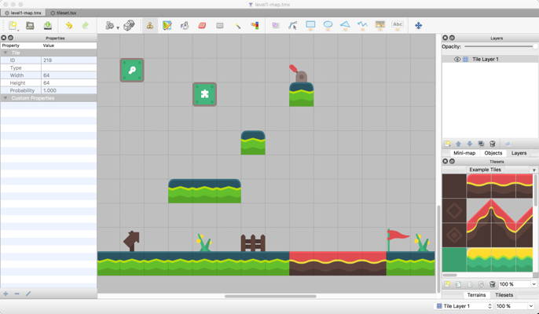
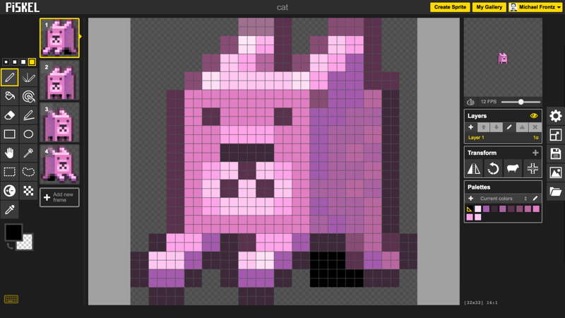
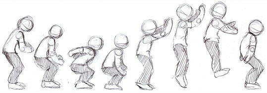

# Visual Assets

This reference section will help with finding and creating visual assets to use in your Phaser games.

Visual assets might include:

* Background images
* Spritesheets for characters
* Images or spritesheets for objects and user interface elements \(icons, etc.\)
* Tileset \(if using [tilemaps](https://photonstorm.github.io/phaser-ce/Phaser.Tilemap.html) to create your game levels\)

### What is a Spritesheet?

A spritesheet is an image typically used for characters or objects that are animated.

The spritesheet is a set of smaller images called frames that have been combined into one large image. The frames are images of the character or object in a different position \(or at a different point in time\).

Each frame within a particular spritesheet has the same width and same height.

An animation is represented by a specific sequence of frames within the spritesheet. A spritesheet can contain one or more animation sequences.

An animation is played by displaying its sequence of frames in rapid succession. The animation can be played just once and then stopped — or the animation can play over and over in a continuous loop.

Spritesheet images must use the PNG format. PNG allows for transparent areas within an image.

This example spritesheet contains 9 frames for an animated character.

* The first four frames show the animation sequence for running to the left \(_imagine these four frames playing over and over again in a loop_\).
* The fifth frame shows the character standing still.
* The last four frames show the the animation sequence for running to the right. 

### What is a Tileset?

A tileset is an image used for creating tilemaps of the level\(s\) in your game.

A tileset is similar to a spritesheet. The tileset is a set of smaller images called tiles that have been combined into one large image. Each tile is an image of a different object or background that can be used to create the game level. The tileset is not the actual level — instead, a _tilemap_ represents the actual layout of the level.

Each tile within a tileset has the same width and same height. Tiles are typically square \(such as 32 pixels by 32 pixels, etc.\).

Tileset images should use the PNG format. PNG allows for transparent areas within an image.

This example tileset contains 264 tiles \(12 rows each containing 22 tiles across\). Each tile is 32 pixels by 32 pixels. Some of the tiles have transparent areas.

### What is a Tilemap?

A Phaser game level can be built as a grid of different tiles. A [tilemap](https://photonstorm.github.io/phaser-ce/Phaser.Tilemap.html) is a data file that indicates which particular tile from the tileset should be displayed in each grid square of the game level.

The tilemap can also be used to identify certain properties of each tile. For example, the tilemap can identify which tiles the player should collide with \(versus tiles that the player can walk through\).

A tilemap can be created using an array, a CSV file, or a JSON file.

[Tiled](http://www.mapeditor.org/) is a free-to-download tile map editor. You import your tileset image into the editor, create the map of your game level as a grid, and then export a JSON tilemap that can be used in your Phaser game.

* [Tiled Map Editor — User Manual](http://doc.mapeditor.org/en/latest/)

Screenshot of **Tiled** map editor showing a game level being created using tiles \(from a tileset\)

### Finding or Creating Images

* [Piskel](https://www.piskelapp.com/) is a sprite editor \(available as web app\) that can be used to create, edit, and save your own spritesheets.
* [Pixlr Editor](https://pixlr.com/editor/) is an image editor \(available as web app or Google Drive app\) that can be used to create, edit, and save images.
* [Kenney](http://kenney.nl/assets?q=2d) is a game development studio that offers free image assets for download as PNG files.  Downloaded assets will include individual images, spritesheets \(for animated sprites\), and tilesets \(for creating tilemaps\).
* [Open Game Art](https://opengameart.org/art-search-advanced) is a website used to share, find, and download open-source game art \(as well as music and sound effects\).
* Other websites or apps may allow you to find, create, or edit image files.
  * Avoid using copyrighted images.
  * Be careful when downloading files from unknown \(and potentially malicious\) sites.

### Recommendations for Image Files

* Image files will typically be JPG, GIF, or PNG format.  Both GIF and PNG formats allow transparent areas in images.
* Spritesheet images must be PNG format.
* Be aware that animated GIF images will not play within a Phaser game — only the first frame of the GIF will be displayed \(even if you try to use the GIF as a spritesheet and add an animation\). You must use a PNG spritesheet to play animations in Phaser.
* Avoid using images with large file sizes, as it could slow down your game. Most of your image files should probably be less than 50 KB. Certain images \(such as: backgrounds, tilesets, texture atlases, etc.\) might be larger.
* If an image file size is large \( &gt; 250 KB\), see if the image size \(width and height\) is larger than what you actually need. If so, use an image editor \(such as: [Pixlr Editor](https://pixlr.com/editor/), etc.\) to resize the image down to the actual size needed, and resave the file.
* If an image does not contain any transparent areas, you may be able to reduce the file size by resaving it as a compressed JPG at a lower quality \(such as: 70%\).
* Be sure the image file names make it easy to identify each image. If necessary, rename the files. \(Reminder: File names should not have blank spaces in them.\)
* Be sure your final image files are uploaded into the **assets/images** subfolder of your team's game folder.

## Create or Modify Animated Sprites Using Piskel

[Piskel](http://www.piskelapp.com/) is a web app that allows you to create, preview, save, and download your own animated sprites \(as spritesheets\). You can also import existing images or spritesheets, and modify them.

* You will need to create a free account in order to save your sprites. The easiest way to do so is to sign in with your Google account.
* Be sure to sign in to your Piskel account before creating a sprite, so you don't lose your work.
* Be sure to periodically save your sprite as you work. \(Piskel does not auto-save.\)
* Be aware that it can take a fair amount of time to create or modify animation frames, since you are typically drawing or editing them manually pixel-by-pixel.

**VIDEO:** [Piskel Quick Tutorial](https://www.youtube.com/watch?v=tlpCU871Xyg)

### Create New Spritesheet in Piskel

1. Sign in to your Piskel account \(or create an account if you haven’t already done so\).
2. Click **Create Sprite** button at top-right of screen. The sprite editor screen will appear, showing a single blank frame.
   * The default frame size for a new sprite is 32 pixels in width and 32 pixels in height \(unless you've changed your default size\).
3. To change the frame size, click **Resize** icon at right \(looks like an arrow pulling a corner\).
4. In "Resize" section at top, enter the desired width and height \(in pixels\) for your frame size. \(All frames in this new sprite will use this same size.\)
   * If your frame size is not supposed to be a perfect square, then be sure **Maintain Aspect Ratio** is unchecked. This will allow you to enter different numbers for the width and height.
5. Click **Resize** button to finish. Your existing blank frame will change to your new size.

To change the **default size** for new sprites:

* Click **Resize** icon.
* In "Default Size" section at bottom, enter the desired width and height \(in pixels\) for your default frame size. \(All new sprites will use this default size.\)
* Click **Set Default** button to save this setting. \(However, it will not change the frame size of the sprite that is currently open.\)

### Import Existing Image or Spritesheet into Piskel

You can import an existing image or spritesheet into Piskel, and then modify it to create a revised sprite.

1. Be sure the existing image or spritesheet is saved on your computer \(where you can find it\).
2. Sign in to your Piskel account \(or create an account if you haven’t already done so\).
3. Click **Create Sprite** button at top-right of screen. The sprite editor screen will appear, showing a single blank frame.
4. Click **Import** icon at right \(looks like an open file folder\).
5. Click **Browse Images** button \(under “Import From Picture”\).
6. A file browser window will appear. Navigate to where the existing image or spritesheet is saved on your computer, select the file, and click **Open** button.
7. A new pop-up called “Import and Merge” appears.
   * It defaults to **Import as Single Image**. If the file is actually just one image \(one frame\), simply click **Next** button \(and go to Step 8\).
   * If the file is a spritesheet \(with multiple frames\), click the radio button for **Import as Spritesheet**. Next enter the width and height \(in that order\) for the **Frame Size**.  \(In most cases, you will leave the "Offset" as zero for both the x and y directions.\) Once you enter the frame size, you will see the spritesheet get divided into frames in the image preview, which helps visually confirm you’ve entered the correct numbers. Click **Next** button.
8. In the next screen, click **Replace** button to have your existing sprite \(which is just a blank frame\) replaced by the imported spritesheet. Piskel will then ask you to confirm that you want to replace your existing \(blank\) sprite. Click **OK** to proceed.
   * **NOTE:** The other option is to **Merge** the imported sprite with existing frames that you've already created.
9. The imported file should now appear in the sprite editor.
   * If you imported a single image, you should see a single frame.
   * If you imported a spritesheet, you should see all its frames.
10. Now you can edit the frame\(s\) for the sprite. Remember to save your edits as you go because Piskel does not auto-save.
11. When you’re done making changes, you can export your revised sprite as a PNG spritesheet, and then use it in your game.

### Export Spritesheet from Piskel

You can export your sprite from Piskel, and then use it in your Phaser game.

1. Click **Export** icon at right \(looks like a picture of mountains with the Sun\).
2. Select tab for **PNG**, and then change the **Spritesheet Layout Options** so the number of columns equals the number of frames in the sprite. \(The number of rows will automatically become 1 when you do this correctly.\)
3. Click **Download** button to save the PNG spritesheet file to your computer.
4. Add the downloaded spritesheet file into the **assets/images** subfolder of your Phaser game folder.

## Recommended Process for Creating Animated Sprites

1. Sketch out each of the new or modified frames for your animation sequence\(s\).
   * Include enough frames so that the animation will be recognizable — but try to limit how many unique frames you need to create.
   * For example, a simple walking animation could be created using just 2 frames \(though you may want more frames to make the animation smoother and more realistic\).

     
2. Decide on the best size \(width and height\) to use for all the frames.
   * Use the size of other objects in the game as a guide, so your new sprite isn't too large or too small compared to these objects.
   * Make the frames large enough to fit the maximum width and maximum height needed for your animation sequence. Kind in mind that all the frames in the spritesheet will end up using this same size.
   * Try to minimize the amount of unused transparent area in your frames.
3. It may help to first draw each frame to scale using [graph paper](https://drive.google.com/open?id=0B8MTiM_lFG9TN0taLXdUdEF5OVk) and colored pencils.
4. Create the digital frames in Piskel using your drawings as a reference.
   * Piskel has a set of basic drawing and editing tools.
   * You can start with a blank frame — or you can import an existing image or spritesheet, and then modify it.
   * Click Resize tool \(at right\) to change the width and height of your frames.
   * You can add, delete, duplicate, and reorder frames.
   * You can use the Duplication tool to make copies of existing frames, and you can use the Transform tool to flip frames horizontally \(creating mirror images\).
     * For example, if you’ve created the first frame in the “left” animation, you can duplicate this frame, and then modify the copy to create the next frame in the “left” animation.
     * For example, if you’ve created all the frames for the “left” animation, you can duplicate each of these frames, and then flip them horizontally to instantly create all the necessary frames for the “right” animation.
   * Piskel shows a preview of your animated sprite in the upper right. You can change the speed \(frames per second\) to see which looks the best. The preview plays all the frames \(in order\) — unfortunately, there isn't a way to select a subset representing a single animation sequence.
   * Remember to periodically save your sprite as you work.
   * Download your completed spritesheet by exporting it.

**RECOMMENDED:** After creating just **one** frame for a sprite, export the spritesheet, and add it to your game to double-check the frame size. Verify the sprite's size is appropriate relative to the other objects in your game. If the sprite is too small or too large, you can make adjustments in your frame size in Piskel **before** you create the rest of the frames. If absolutely necessary, you can use your game code to scale sprites \(to make them larger or smaller\), but it is better to create the sprites at the actual size you want them to be in your game \(without having to scale them with Phaser\).

